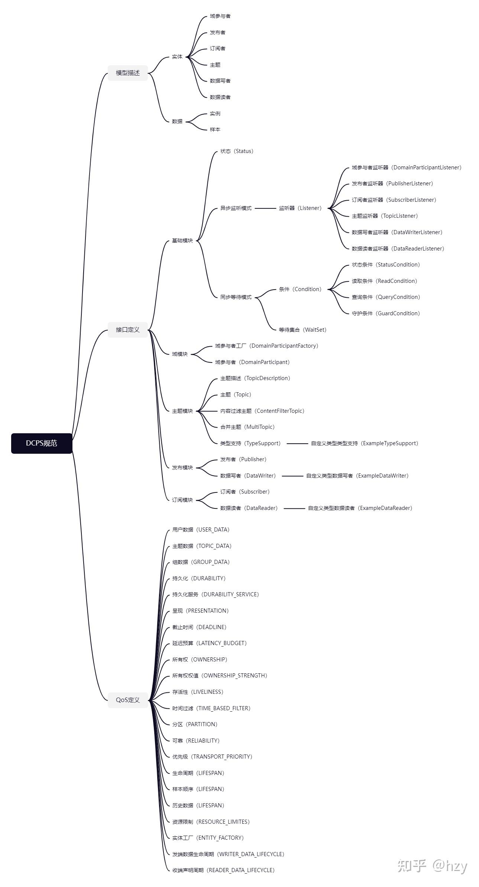

## 1. 概述

DCPS（**D**ata-**C**entric **P**ublish-**S**ubscribe，以数据为中心的发布/订阅）规范是DDS系列规范最初也是最核心的规范，在某些场合DDS规范指的就是DCPS规范。大家可以在[这个链接](https://www.omg.org/spec/DDS/)看到最新的DCPS规范及其相关的附件。

## 2. DCPS-PIM

DCPS的内容总结在下面这张图中，主要分为三大块，这篇文章也将按照导图中的内容依次介绍：

- 模型描述，介绍模型中涉及的概念；
- 接口描述，分模块定义类并定义接口形式及接口功能描述；
- QoS定义，定义22种QoS的功能及其配置方式。



DCPS协议内容

### 2.1. 模型描述

#### 2.1.1. 实体概念

这里不想写的太复杂，只用最简单的一句话来描述：

- 基于主题的发布/订阅模型
    - 系统的数据按照主题来分类；
    - 发布端发布主题数据；
    - 订阅端订阅主题数据；
    - 发布端发布的主题数据后，相同主题的订阅端都能收到。

- DCPS实体模型定义了三层实体，如下图所示
    - 域参与者（DomainParticipant）
        - 这个实体看上去和发布/订阅模型没啥关系，实际上也没啥关系。主要是DDS里面定义了域的概念用来隔离通信，相同域内实体互相通信，不同域间隔离。
        - 这是应用参加DDS系统通信的入口实体，创建某个域下的域参与者表示：“我想要参与某个域进行通信（是发布还是订阅后面再告诉你）”。
    - 发布者（Publisher）
        - 这个最好理解，应用创建发布者表示：“我需要发布数据（具体发布什么主题数据，后面再告诉你）”；
    - 订阅者（Subscriber）
        - 这个也好理解，应用创建发布者表示：“我需要订阅数据（具体发布什么主题数据，后面再告诉你）”；
    - 主题（Topic）
        - 主题用来描述一类数据，创建主题表示：“我有这么一类数据需要交互”；
        - 定义主题需要什么信息，后面章节详细介绍；
    - 数据写者（DataWriter）
        - 数据写者关联一个且仅一个主题实体，用来向全局数据空间写指定主题的数据；
        - 应用创建数据写者表示：“我需要发布XX主题数据。”
    - 数据读者（DataReader）
        - 数据读者关联一个且仅一个主题实体，用来从全局数据空间读指定主题的数据；
        - 应用创建数据读者表示：“我需要订阅XX主题数据。”


DCPS实体层次

#### 2.1.2. 数据描述

DCPS模型中有几个重要的概念来描述系统中传输的数据，如下图所示自顶向下分为三层来描述系统中交互的数据。

| 概念 | 说明 | 标识 |
| --- | --- | --- |
| 主题 | 最大类，域内唯一的主题名称，并关联1个数据类型。 | 主题名+类型 |
| 实例 | 主题数据中key成员相同的数据的集合，即使用key成员进一步区分主题数据，可以理解成“子主题”。 | InstanceHandle_t |
| 样本 | 每次向DDS发送一次数据产生一个数据样本。 | 序列号 |


数据描述

### 2.2. 接口描述

接口描述部分，这篇文章只讲思路以及每个类的函数名，具体的函数参数或者说明省略。

#### 2.2.1. 基础模块

基础模块包含了DCPS的接口定义的几个重要的原则：

- 实体管理（创建/删除/查询）采用工厂模式，父实体为子实体的工厂，层级关系参见2.2.1节；
- 每个实体会关联一组内部的**状态**；
    - 状态可以通过实体提供的查询接口查询获取；
    - 状态可以通过监听器由底层回调获取；
    - 状态可以通过“条件-等待”的方式同步阻塞获取；
- 每个实体都会关联一系列的QoS配置；

##### 2.2.1.1. 实体状态

实体状态表示DDS为用户关心的底层事件所维护的状态，例如数据写者关联成功匹配远程数据读者、检测到数据读者数据样本丢失、检测到主题的类型不兼容等。每个实体会关联一系列的代表该实体“通信状态”的状态对象。实体关联的状态参见下图。状态结构体中包含的数值可以提供更多关于该状态的信息。


实体状态及其接口

##### 2.2.1.2. 获取实体状态

状态分为两种类型：
- 简单通信状态 ：除了表明状态是否改变的标识还包含保存当前状态的对应结构体。
- 读通信状态：读通信状态更像一个事件，除了是否发生以外没有其他声明。

只有两个状态是读通信状态： DATA_AVAILABLE_STATUS 和 DATA_ON_READERS_STATUS 。


从DDS中获取状态以及数据的三种模式

下面分别描述获取实体简单通信状态有三种方式 : 
- 同步获取实体状态，参见上图最左边图，用户想要获取某个状态的当前值时，主动调用该状态有关的实体方法，获取各实体状态的实体方法参见2.2.1.1中的图；
- 同步等待并获取实体状态，参见上图中间的图，用户设置等待条件，并调用DDS接口进行阻塞等待，在DDS底层检测到该状态发生变化后，解开阻塞，用户再通过方法1获取该状态；
- 异步回调实体状态，参见上图右边的图，该方式为通过监听器异步回调状态 ，用户为实体设置相应的监听器（再进行其他的业务逻辑），DDS底层检测到该状态变化时，通过回调监听器的相应方法，用户即可获取该状态的值，各实体状态关联的回调方法参见参见2.2.1.1中的图。

##### 2.2.1.3. 条件-等待

DDS使用条件（ Condition ）以及等待（ WaitSet ）来实现同步等待模型，其中每个条件均有一个触发状态，不同类型的状态的触发条件不一样，可以将一个或者多个条件加入到等待集合中，即允许用户同时等待多个状态的集合中的某个状态触发。条件的类型及其相关的操作参见，使用条件等待的详细例子参见

| 说明 | 状态条件（ StatusCondition ） | 读取条件 （ ReadCondition ） | 监视条件（ GuardCondition ） |
| --- | --- | --- | --- |
| 简介 | 该条件用于获取实体状态改变 | 该条件用于获取数据读者的数据状态改变 | 该条件用于手动解开阻塞的条件集合 |
| 获取方式 | 每个实体均会关联一个该条件，调用 Entity::get_statuscondition 方法获取 | 由数据读者作为该条件的工厂， DataReader::create_readcondition 、 DataReader::delete_readcondition | 用户负责状态的生命周期管理 (new/delete) |
| 触发方式 | StatusCondition::set_enabled_statuses 设置的关心的状态发生改变 | 数据读者底层有该状态所表示的数据样本的时候触发 | 用户通过监视条件的接口手动设置 |
| 触发后的动作 | 首先测试发生改变的状态，再调用相应的状态获取方法获取 | 调用数据读者的读取数据方法获取改变的数据 DataReader::read_w_condition DataReader::take_w_condition | 无 |


##### 2.2.1.4. 监听器

DDS通过监听器提供底层状态事件异步回调的机制，每个实体状态在相应的实体监听器中均有相应的回调函数与之对应，实体回调函数与实体状态的对应关系参见 2.2.1.1中的图 。下图显示了DDS中各个监听器的继承关系，即父实体的监听器继承于子类的监听器，这就意味着父实体监听器能够获取所有子实体的状态变化。


DDS中各个监听器的继承关系

#### 2.2.2. 域模块

在发布订阅模型中，理论上每个计算机上的中间件都需要掌握全局的节点信息，以提供分布式的数据传输服务。但在实际应用中，可能存在需要隔离的情况，例如网络中的节点数量过于庞大，掌握全局信息会付出巨大的代价，或者从属于不同分区的小组之间不希望互相干扰。为了解决隔离的问题，DDS引入了域的概念。每个参与通信的计算机都可以加入一个或多个域，相同域内的节点可以互相通信，不同域之间的节点则不会有数据交互。DDS中使用 DomainId 来唯一标识一个域。域参与者实体是DDS的入口，用户创建一个域参与者表示该程序想要在指定的域中交互数据。域模型示意图参见下图，一个应用程序可以在多个域中交互数据。


DDS中域与域参与者概念

##### 2.2.2.1. 域参与者工厂

域参与者实体的工厂为全局单例的域参与者工厂( DomainParticipantFactory )，域参与者工厂的主要功能参见下表。

| 功能 | 接口 |
| --- | --- |
| 单例管理 | DomainParticipantFactory::get_instance |
| ^ | DomainParticipantFactory::finalize_instance |
| 作为域参与者的工厂 | DomainParticipantFactory::create_participant |
| ^ | DomainParticipantFactory::delete_participant |
| ^ | DomainParticipantFactory::lookup_participant |
| ^ | DomainParticipantFactory::get_default_participant_qos |
| ^ | DomainParticipantFactory::set_default_participant_qos |
| 自身QoS管理 | DomainParticipantFactory::set_qos |
| ^ | DomainParticipantFactory::get_qos |


##### 2.2.2.2. 域参与者

域参与者( DomainParticipant )，主要接口的功能参见下表，此外，域参与者内部还实现发现协议、根据线程模型配置初始化线程、创建定时器、申请并创建网络传输需要的资源，并监听对应的网络端口，负责处理网络报文等，域参与者所需的资源较多，内部逻辑复杂，因而在一个应用中应尽可能的减少域参与者的创建。

| 功能 | 接口 |
| --- | --- |
| 实体功能 | DomainParticipant::enable |
| ^ | DomainParticipant::set_listener |
| ^ | DomainParticipant::get_listener |
| ^ | DomainParticipant::set_qos |
| ^ | DomainParticipant::get_qos |
| ^ | DomainParticipant::get_instance_handle |
| ^ | DomainParticipant::get_status_changes |
| ^ | DomainParticipant::get_statuscondition |
| 作为实体工厂 | DomainParticipant::delete_contained_entities |
| ^ | DomainParticipant::contains_entity |
| 作为主题实体工厂 | DomainParticipant::create_topic |
| ^ | DomainParticipant::delete_topic |
| ^ | DomainParticipant::get_default_topic_qos |
| ^ | DomainParticipant::set_default_topic_qos |
| ^ | DomainParticipant::lookup_topicdescription |
| ^ | DomainParticipant::find_topic |
| ^ | DomainParticipant::create_contentfilteredtopic |
| ^ | DomainParticipant::delete_contentfilteredtopic |
| 作为发布者实体工厂 | DomainParticipant::create_publisher |
| ^ | DomainParticipant::delete_publisher |
| ^ | DomainParticipant::get_default_publisher_qos |
| ^ | DomainParticipant::set_default_publisher_qos |
| ^ | DomainParticipant::get_publishers |
| 作为订阅者实体工厂 | DomainParticipant::create_subscriber |
| ^ | DomainParticipant::delete_subscriber |
| ^ | DomainParticipant::get_default_subscriber_qos |
| ^ | DomainParticipant::set_default_subscriber_qos |
| ^ | DomainParticipant::get_subscribers |
| 内置实体管理 | DomainParticipant::get_builtin_subscriber |
| 通信管理 | DomainParticipant::ignore_participant |
| ^ | DomainParticipant::ignore_publication |
| ^ | DomainParticipant::ignore_subscription |
| 域信息查询 | DomainParticipant::get_domain_id |
| ^ | DomainParticipant::get_discovered_participants |
| ^ | DomainParticipant::get_discovered_participant_data |
| ^ | DomainParticipant::get_discovered_topics |
| ^ | DomainParticipant::get_discovered_topic_data |
| 存活性管理 | DomainParticipant::assert_liveliness |


#### 2.2.3. 主题模块

| 功能 | 接口 |
| --- | --- |
| 实体功能 | Topic::enable |
| ^ | Topic::set_listener |
| ^ | Topic::get_listener |
| ^ | Topic::get_instance_handle |
| ^ | Topic::get_status_changes |
| ^ | Topic::get_statuscondition |
| ^ | Topic::set_qos |
| ^ | Topic::get_qos |
| 获取主题信息 | Topic::get_type_name |
| ^ | Topic::get_name |


##### 2.2.3.1. 类型支持

放到IDL规范时再介绍。

##### 2.2.3.2. 内容过滤的主题

放到IDL规范时再介绍。

#### 2.2.4. 发布模块

##### 2.2.4.1. 发布者

| 功能 | 接口 |
| --- | --- |
| 实体功能 | Publisher::enable |
| ^ | Publisher::set_listener |
| ^ | Publisher::get_listener |
| ^ | Publisher::get_instance_handle |
| ^ | Publisher::get_status_changes |
| ^ | Publisher::get_statuscondition |
| ^ | Publisher::get_participant |
| ^ | Publisher::set_qos |
| ^ | Publisher::get_qos |
| 作为数据写者的工厂 | Publisher::create_datawriter |
| ^ | Publisher::delete_datawriter |
| ^ | Publisher::lookup_datawriter |
| ^ | Publisher::delete_contained_entities |
| ^ | Publisher::set_default_datawriter_qos |
| ^ | Publisher::get_default_datawriter_qos |
| ^ | Publisher::copy_from_topic_qos |
| 数据发布控制 | Publisher::begin_coherent_changes |
| ^ | Publisher::end_coherent_changes |
| ^ | Publisher::wait_for_acknowledgments |
| ^ | Publisher::suspend_publications |
| ^ | Publisher::resume_publications |


##### 2.2.4.2. 数据写者

数据写者主要的功能描述参见下表，数据写者提供强类型安全的接口，该接口由DDS编译器根据IDL中定义的类型自动生成，其中类型无关的接口参见 DataWriter 、类型相关的接口参见 ExampleDataWriter 接口说明，典型的发布过程如下 。

| 功能 | 接口 |
| --- | --- |
| 实体功能 | DataWriter::enable |
| ^ | DataWriter::set_listener |
| ^ | DataWriter::get_listener |
| ^ | DataWriter::get_instance_handle |
| ^ | DataWriter::get_status_changes |
| ^ | DataWriter::get_statuscondition |
| ^ | DataWriter::set_qos |
| ^ | DataWriter::get_qos |
| 数据发送 | ExampleDataWriter::write |
| ^ | ExampleDataWriter::write_w_timestamp |
| ^ | ExampleDataWriter::write_w_dst |
| 数据实例管理 | ExampleDataWriter::register_instance |
| ^ | ExampleDataWriter::register_instance_w_timestamp |
| ^ | ExampleDataWriter::unregister_instance |
| ^ | ExampleDataWriter::unregister_instance_w_timestamp |
| ^ | ExampleDataWriter::dispose |
| ^ | ExampleDataWriter::dispose_w_timestamp |
| ^ | ExampleDataWriter::get_key_value |
| ^ | ExampleDataWriter::lookup_instance |
| 实体状态查询 | DataWriter::get_liveliness_lost_status |
| ^ | DataWriter::get_offered_deadline_missed_status |
| ^ | DataWriter::get_offered_incompatible_qos_status |
| ^ | DataWriter::get_publication_matched_status |
| 数据写者信息查询 | DataWriter::get_topic |
| ^ | DataWriter::get_publisher |
| 匹配对端信息查询 | DataWriter::get_matched_subscriptions |
| ^ | DataWriter::get_matched_subscription_data |
| 存活性管理 | DataWriter::assert_liveliness |
| 其他 | DataWriter::wait_for_acknowledgments |
| ^ | DataWriter::flush |


#### 2.2.5. 订阅模块

##### 2.2.5.1. 订阅者

| 功能 | 接口 |
| --- | --- |
| 实体功能 | Subscriber::enable |
| ^ | Subscriber::set_listener |
| ^ | Subscriber::get_listener |
| ^ | Subscriber::get_instance_handle |
| ^ | Subscriber::get_status_changes |
| ^ | Subscriber::get_statuscondition |
| ^ | Subscriber::get_participant |
| ^ | Subscriber::set_qos |
| ^ | Subscriber::get_qos |
| 作为数据读者的工厂 | Subscriber::create_datareader |
| ^ | Subscriber::delete_datareader |
| ^ | Subscriber::lookup_datareader |
| ^ | Subscriber::delete_contained_entities |
| ^ | Subscriber::set_default_datareader_qos |
| ^ | Subscriber::get_default_datareader_qos |
| ^ | Subscriber::copy_from_topic_qos |
| 数据获取方式 | Subscriber::begin_access |
| ^ | Subscriber::end_access |
| ^ | Subscriber::get_datareaders |
| ^ | Subscriber::notify_datareaders |


##### 2.2.5.2. 数据读者

数据读者的类型无关功能描述参见下表，数据读者提供强类型安全的接口，该接口由DDS编译器根据IDL中定义的类型自动生成，其中类型无关的接口参见DataReader 、类型相关的接口参见 ExampleDataReader 接口说明。

| 功能 | 接口 |
| --- | --- |
| 实体功能 | DataReader::enable |
| ^ | DataReader::set_listener |
| ^ | DataReader::get_listener |
| ^ | DataReader::get_instance_handle |
| ^ | DataReader::get_status_changes |
| ^ | DataReader::get_statuscondition |
| ^ | DataReader::set_qos |
| ^ | DataReader::get_qos |
| 实体状态查询 | DataReader::get_sample_lost_status |
| ^ | DataReader::get_sample_rejected_status |
| ^ | DataReader::get_subscription_matched_status |
| ^ | DataReader::get_liveliness_changed_status |
| ^ | DataReader::get_requested_deadline_missed_status |
| ^ | DataReader::get_requested_incompatible_qos_status |
| 数据读者信息查询 | DataReader::get_topicdescription |
| ^ | DataReader::get_subscriber |
| 匹配对端信息查询 | DataReader::get_matched_publications |
| ^ | DataReader::get_matched_publication_data |
| 读取状态管理 | DataReader::create_readcondition |
| ^ | DataReader::create_querycondition |
| ^ | DataReader::delete_readcondition |
| ^ | DataReader::delete_contained_entities |
| 其他 | DataReader::wait_for_historical_data |


##### 2.2.5.3. 获取主题数据

当数据样本到达订阅端时，DDS底层会根据主题匹配信息分发给不同的数据读者去处理，当完成处理（资源限制等QoS配置）时，数据读者将把该数据样本存储在底层的队列中，并通知用户，再等待用户通过接口来取出该数据样本，DDS通知用户数据到达的方式有两种：异步监听方式以及同步等待方式，用户通过数据读者的读取数据接口访问底层队列中的数据样本，这些接口的摘要信息参见下表，详细信息参见相应的接口说明。用户可以通过多种方式访问底层存储的队列数据：

1. 提供样本深拷贝以及零拷贝（仅提供数据样本在底层队列中的指针或者引用）两种方式；
2. 指定最大获取数量；
3. 访问处于指定状态的样本，样本状态由 SampleStateKind 、 ViewStateKind 、 InstanceStateKind 三个状态定义；
4. 按照数据实例访问，包括指定数据实例以及按数据实例顺序；
5. 按照样本的顺序依次访问；
6. 读取/取出两种访问方法，其中读取操作不从底层队列中删除，而取出操作则从底层维护的样本中删除；

| 分类 | 接口 | 说明 |
| --- | --- | --- |
| 读取系列 | ExampleDataReader::read | 方式1 & 方式2 & 方式3 |
| ^ | ExampleDataReader::read_next_sample | 方式5 |
| ^ | ExampleDataReader::read_instance | 方式1 & 方式2 & 方式3 & 方式4 |
| ^ | ExampleDataReader::read_next_instance | 方式1 & 方式2 & 方式3 & 方式4 |
| ^ | ExampleDataReader::read_w_condition | 同 ExampleDataReader::read |
| ^ | ExampleDataReader::read_next_instance_w_condition | 同 ExampleDataReader::read_next_instance |
| 取出系列 | ExampleDataReader::take | 方式1 & 方式2 & 方式3 |
| ^ | ExampleDataReader::take_next_sample | 方式5 |
| ^ | ExampleDataReader::take_instance | 方式1 & 方式2 & 方式3 & 方式4 |
| ^ | ExampleDataReader::take_next_instance | 方式1 & 方式2 & 方式3 & 方式4 |
| ^ | ExampleDataReader::take_w_condition | 同 ExampleDataReader::take |
| ^ | ExampleDataReader::take_next_instance_w_condition | 同 ExampleDataReader::take_next_instance |
| 归还空间 | ExampleDataReader::return_loan | 配合实现零拷贝 |


### 2.3. QoS定义

下一期再继续分享。

## 3. PSM-IDL

因为上面定义的是平台/技术无关的模型，在这一章OMG用IDL给出了DCPS的一种定义，所谓PIM就是只规定形式和行为，具体数据结构在PSM中给出，这是OMG DDS规范的一般套路，打个比方，在PIM中会定义 InstanceHandle_t 这个结构的含义是用来唯一标识实体或者数据实例，但是不会规定如何来实现，在PSM中会定义 InstanceHandle_t 就是8个字节或者16个字节。IDL定义文件参见[这里](https://www.omg.org/spec/DDS/20140501/dcps.idl)。

## 4. 开发流程


DDS开发流程以及接口调用顺序

## 5. 代码示例

### 5.1. 发布端

```cpp
#include "DomainParticipantFactory.h"
#include "DomainParticipant.h"
#include "DefaultQos.h"
#include "Publisher.h"
#include "DataWriter.h"
#include "Topic.h"
#include "Foo.h"
#include "FooDataWriter.h"
#include "FooTypeSupport.h"
#include "ZRSleep.h"
#include <stdio.h>
int main()
{
    // 域
    DomainId_t domainId = 1;
    DomainParticipantFactory *factory = DomainParticipantFactory::get_instance();
    // 域参与者
    DomainParticipant *participant = factory->create_participant(
        domainId, 
        DOMAINPARTICIPANT_QOS_DEFAULT, 
        NULL, STATUS_MASK_NONE);
    if (NULL == participant)
    {
        printf("create participant failed.\n");
        return -1;
    }
    // 注册类型
    const Char* type_name = FooTypeSupport::get_instance()->get_type_name();
    if (type_name == NULL)
    {
        return -1;
    }
    ReturnCode_t rtn = FooTypeSupport::get_instance()->register_type(participant, type_name);
    if (rtn != RETCODE_OK)
    {
        printf("register type failed.\n");
        return -1;
    }
    // 创建主题
    Topic *topic = participant->create_topic("example", type_name, TOPIC_QOS_DEFAULT, NULL, STATUS_MASK_NONE);
    if (topic == NULL)
    {
        printf("create topic failed.\n");
        return -1;
    }
    // 创建发布端
    Publisher *publisher = participant->create_publisher(
        PUBLISHER_QOS_DEFAULT, 
        NULL, STATUS_MASK_NONE);
    if (publisher == NULL)
    {
        printf("create publisher failed.\n");
        return -1;
    }
    // 创建数据写者
    DataWriterQos writer_qos;
    publisher->get_default_datawriter_qos(writer_qos);
    writer_qos.history.depth = 5;
    DataWriter *writer = publisher->create_datawriter(
        topic, writer_qos, NULL, STATUS_MASK_NONE);
    FooDataWriter *_writer = dynamic_cast<FooDataWriter*>(writer);
    if (writer == NULL)
    {
        printf("create datawriter failed.\n");
        return -1;
    }
    // 创建数据样本
    Foo sample;
    while (true)
    {
        // 在此处修改数据样本的值

        // 发布数据样本
        _writer->write(sample, HANDLE_NIL_NATIVE);
        ZRSleep(1000);
    }
    return 0;
}
```

### 5.2. 订阅端

```cpp
#include "DomainParticipantFactory.h"
#include "DomainParticipant.h"
#include "DefaultQos.h"
#include "Subscriber.h"
#include "DataReader.h"
#include "Topic.h"
#include "DataReaderListener.h"
#include "Foo.h"
#include "FooDataReader.h"
#include "FooTypeSupport.h"
#include "ZRSleep.h"
#include <stdio.h>
// 继承DataReaderListener
class Mylistener : public DataReaderListener
{
    // 回调函数
    void on_data_available(DataReader *the_reader)
    {
        printf("received data.\n");
        FooDataReader *foo_reader = dynamic_cast<FooDataReader*>(the_reader);
        if (foo_reader == NULL)
        {
            printf("cast reader failed.\n");
            return;
        }
        FooSeq data_values;
        SampleInfoSeq sample_infos;
        ReturnCode_t rtn;
        rtn = foo_reader->take(data_values, 
            sample_infos, 
            MAX_INT32_VALUE, 
            ANY_SAMPLE_STATE, 
            ANY_VIEW_STATE, 
            ANY_INSTANCE_STATE);
        if (RETCODE_ERROR == rtn)
        {
            printf("take failed.\n");
            return;
        }
        if (RETCODE_NO_DATA == rtn)
        {
            printf("no data.\n");
            return;
        }
        for (int i = 0; i < sample_infos.length(); i++)        
        {
            if (sample_infos[i].valid_data)
            {
                FooPrintData(&data_values[i]);
            }
        }
        foo_reader->return_loan(data_values, sample_infos);
    }
};
int main()
{
    // 域
    DomainId_t domainId = 1;
    DomainParticipantFactory *factory = DomainParticipantFactory::get_instance();
    // 域参与者
    DomainParticipant *participant = factory->create_participant(
        domainId, 
        DOMAINPARTICIPANT_QOS_DEFAULT, 
        NULL, STATUS_MASK_NONE);
    if (NULL == participant)
    {
        printf("create participant failed.\n");
        return -1;
    }
    // 注册类型
    const Char* type_name = FooTypeSupport::get_instance()->get_type_name();
    if (NULL == type_name)
    {
        return -1;
    }
    ReturnCode_t rtn = FooTypeSupport::get_instance()->register_type(participant, type_name);
    if (RETCODE_OK != rtn)
    {
        printf("register type failed.\n");
        return -1;
    }
    // 创建主题
    Topic *topic = participant->create_topic("example", type_name, TOPIC_QOS_DEFAULT, NULL, STATUS_MASK_NONE);
    if (NULL == topic)
    {
        printf("create topic failed.\n");
        return -1;
    }
    // 创建订阅端
    Subscriber *subscriber = participant->create_subscriber(
        SUBSCRIBER_QOS_DEFAULT, 
        NULL, STATUS_MASK_NONE);
    if (NULL == subscriber)
    {
        printf("create subscriber failed.\n");
        return -1;
    }
    // 监听器
    Mylistener *listener = new Mylistener;
    // 创建数据读者
    DataReaderQos reader_qos;
    subscriber->get_default_datareader_qos(reader_qos);
    reader_qos.history.depth = 5;
    DataReader *reader = subscriber->create_datareader(
        topic, reader_qos, listener, STATUS_MASK_ALL);
    FooDataReader *_reader = dynamic_cast<FooDataReader*>(reader);
    if (NULL == reader)
    {
        printf("create datareader failed.\n");
        return -1;
    }
    while (true)
    {
        ZRSleep(1000);
    }
    return 0;
}
```
