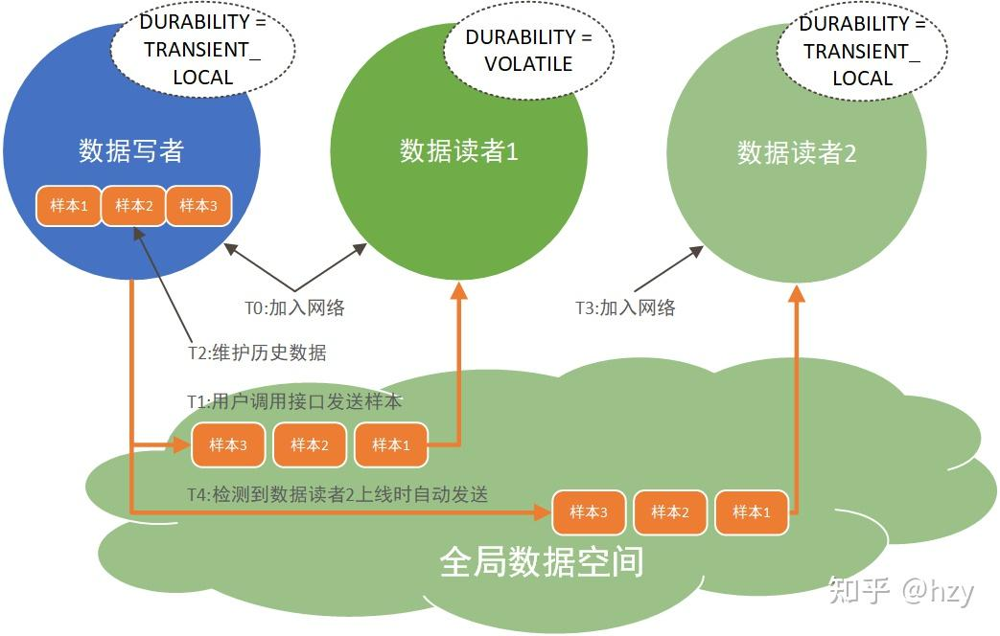

本期还是DCPS规范，填上期没有聊完的QoS的坑。

## 1. 概述

_“数据还可以通过灵活的服务质量 (QoS) 规范进行共享，包括可靠性、系统运行状况（活跃性）甚至安全性。在真实的系统中，并非所有其他端点都需要本地存储中的所有数据。 DDS 很聪明，只发送它需要的内容。如果消息并不总是到达预期目的地，中间件会在需要时实现可靠性。当系统发生变化时，中间件会动态地确定将哪些数据发送到哪里，并智能地将变化通知参与者。如果总数据量很大，DDS会智能过滤并仅发送每个端点真正需要的数据。当需要快速更新时，DDS 会发送多播消息来同时更新许多远程应用程序。随着数据格式的发展，DDS 会跟踪系统各个部分使用的版本并自动进行转换。对于安全关键型应用程序，DDS 控制访问、强制执行数据流路径并动态加密数据。“_

以上这段话是DDS官网对QoS的说明，第一段中的描述涉及到：可靠性QoS、存活性QoS、基于时间过滤QoS、类型兼容QoS以及安全QoS。这些在后面会详细说明。

_”当您在非常动态、要求严格且不可预测的环境中以极高的速度同时指定所有这些内容时，DDS 的真正威力就会显现出来。”_

上面这句话里面的“同时”这个关键词总结了QoS真正能够发挥重要作用的场景。也就是说当一个大系统里面存在多种数据需要传输并且对不同数据的传输“需求”不同的场景。QoS是DDS标榜自己区别于其他中间件的重要特征，也是很多架构师在选用DDS技术作为架构的理由，但实际情况是QoS到底在系统中有什么用，并没有想清楚，我见过的大部分场景中用户也只能提出来是否需要可靠外加底层通过什么通信协议通信，这种情况下起初因为“QoS”选择DDS的初衷就没办法在系统中体现。

简单来说，QoS就是DDS配置，类比到socket里面就是set_option，通过set_option可以配置缓冲区大小、阻塞/非阻塞模式，优先级等。QoS提供配置来完成以下几类功能：

- 通信需求配置：DDS会总结常用的通信需求，并抽象为典型的配置项由用户来选择，典型的包括：可靠性、持久化、优先级、延迟预算、截止时间等；
- 数据呈现配置：控制DDS如何把数据呈现给收端，排序、分组、过滤等，包括：所有权/权值、基于时间过滤、样本顺序、数据表现、过期时间等；
- 资源使用配置：DDS可以通过QoS来配置使用的系统资源，典型的包括：历史数据、资源限制、发端数据周期、收端数据周期；
- 发现阶段配置：实体携带数据、组携带数据、主题携带数据、分区、存活性；

分类及其简单的介绍、配置项参见下面两张图，这里只总结DCPS规范中的QoS，在其他规范中扩展的QoS暂时不考虑，例如：DDS安全规范中添加的安全配置、DDS-XTypes规范中添加的数据兼容性配置等。

QoS分类-通信需求以及数据呈现

QoS分类-资源需求以及自动发现

## 2. QoS检查

### 2.1. 组合

上期我们提到DDS中定义了多种实体：域参与者、发布者、订阅者、数据读者、数据写者、主题，每个实体都可以配置上面列出来的多个QoS配置。具体的对应情况这里就不一一列出，可以参见DCPSV1.4规范的2.2.3章节的表格的Concerns列。

### 2.2. 有效性和兼容性

DDS对用户配置的QoS进行几个方面的检查，具体的每个QoS的检查同样查看上面规范中的表格或者私信我一起讨论：

- 有效性：在本地判断配置的QoS的值是否在允许的范围内，比如：资源限制中的max_samples必须要大于0；
- 本地兼容性：在本地判断同一个实体上配置的多个配置项不能互相矛盾，比如：截止时间配置至少1s接收一包，基于时间过滤的配置又配置报文间隔最小是2s，这就是属于矛盾的配置；
- 匹配兼容性：在自动发现阶段后匹配阶段检查，数据写者与数据读者端的QoS是否兼容，需要满足：“提供的服务等级 > 需求的服务等级”，例如：数据写者配置BEST-EFFORT，表示我提供尽力而为的传输服务，数据读者配置RELIABLE，表示我需要可靠的传输服务，这种情况下数据读者的可靠性配置无法满足，这就是不兼容的QoS配置。

### 2.3. QoS影响

这里涉及到QoS如何作用，大概分为两类：

- 影响DDS实体的状态，这些状态可以通过相应的接口获取，具体可以参考上一篇文章中的 2.2.1.1. 实体状态 章节。
- 影响底层的传输模式，比如：配置可靠模式后，底层就是启动反馈重传的可靠机制等；

## 3. QoS应用

QoS个数比较多，每个都详细分析篇幅会比较长，下面会选择几个比较常用的QoS进行详细分析，对其他QoS感兴趣的可以私信一起讨论，QoS的应用还需要在实际应用中进行探索甚至扩展。

### 3.1. 可靠性策略

一般理解：应用是否需要DDS提供可靠传输，需要就是设置kind == RELIABLE，否则就设置kind == BEST-EFFORT。下面从两个看起来比较愚蠢的疑问来进一步分析。

#### 3.1.1. 设置为BEST-EFFORT就一定不可靠吗？

答案是不一定。因为DDS里定义的可靠性QoS指的是“是否需要DDS做**额外**的可靠保证。”，比如传输层使用的是TCP传输或者其他RTPS底层的协议已经保证了可靠的传输，这时候配置DDS为BEST-EFFORT同样可以实现可靠的传输。

#### 3.1.2. 设置为RELIABLE就一定可靠吗？

答案同样是不一定。可靠的实现方式是确认重传，简单来说就是在接收到告知发送端数据已经收到之前，数据是需要缓存在队列中以备可能需要的重传，既然有队列，就会有长度限制（无论是存储在内存还是文件中，受限于存储空间的大小），当队列到达上限并需要发送新的样本数据时，会有如下的几个处理方式：

- 替换老的样本数据，这种处理模式下，当被替换的数据丢包需要重传时，无法重传，从而造成“丢包”，就是无法实现可靠；
- 阻塞等待队列有额外的空间，这种处理模式下可以实现“绝对”的可靠；

上面提到的队列的长度限制在DDS中就体现在历史数据测试（History）以及资源限制策略（ResourceLimits）

#### 3.1.3. 应用场景

可靠性的应用场景比较好定义，一般周期性的数据或者接收端只关心最新数据的场景下，设置为BEST-EFFORT；控制命令等关键的数据配置为可靠模式。

### 3.2. 持久化策略

对于数据写者和数据读者的含义分别是：

- 数据写者：控制是否保存**当前**所有匹配数据读者端已经确认的样本数据；
- 数据读者：控制数据读者是否需要加入网络前的历史数据；

主要分为两类：

- VOLATILE：不保留/不需要历史数据，这是默认的配置，这种模式节省空间，只要当前所有的数据读者均确认接收就可以把这包数据从DDS内部删除；
- TRANIENT_LOCAL/TRANSENT/PERSISTENT，这三种表示保留/需要历史数据，只是历史数据保存的方式不同，其中最常用的TRANSIENT_LOCAL是保存在数据写者内部管理的内存队列中，而后两种则需要额外的服务（独立的进程）来保存数据；

持久化策略示意图

上图是一个简单的示意图，其中数据写者配置的是TRANSIENT_LOCAL，数据读者1配置的VOLATILE，数据读者2配置的TRANSIENT_LOCAL，按照时间描述系统运行的过程如下：

- T0时刻，数据写者和数据读者1同时上线，通过自动发现协议相互感知；
- T1时刻，用户调用接口发送3个样本数据；
- T2时刻，数据写者根据自己配置的是TRANSIENT_LOCAL模式，将发送的3个样本数据保存在内部的队列中；
- T3时刻，数据读者2上线，通过自动发现协议和数据写者相互感知；
- T4时刻，数据写者发现数据读者2需要历史数据，则会将缓存的3个数据样本发送给数据读者2；

#### 3.2.1. 应用场景

持久化策略是实现“时间解耦”的重要QoS，即用户可以通过该QoS解除系统中应用启动先后顺序的限制。或者是在上线后需要及时获取系统中关心的最新状态的场景。

### 3.3. 分区策略

域内构成逻辑分区（通信平面的概念）由一个字符串序列组成，每个字符串表示一个分区的名称。

- 分区策略与域隔离的主要区别：
    - 不同域之间完全隔离，不会有任何数据交互，但分区信息在同一个域内传输。
    - 域号创建后无法更改；
    - 实体只能属于一个域，但是可以属于多个分区。

- 分区策略与主题隔离的主要区别：
    - 主题/服务在创建发布/订阅绑定后无法更改；
    - 分区策略在创建后可以更改并生效；

- 发送端与接收端匹配的条件如下：
    - 发送端与接收端所属的域参与者处于同一个域；
    - 发送端与接收端关联的主题名称以及主题关联的数据类型相同；
    - 发送端与接收端及其所属的发布者以及订阅者的QoS满足匹配规则（在同一个分区）；

分区策略示意图

#### 3.3.1. 应用场景

- 分区可以在域不够用的时候构建更多的逻辑通信平面；
- 同一份数据需要属于多个分类的场景可以用分区关联；

### 3.4. 截止时间策略

- 在发布端，应用必须遵循这个约定，即在截止时间内必须发布一个数据（调用write()函数）。如果应用未遵循该约定， 则修改OFFERED_DEADLINE_MISSED_STATUS状态以及调用监听器中on_offered_deadline_missed方法。
- 在订阅端，表示对端的（所有匹配）发布者应该能够满足订阅者期望得到数据的最低要求（最长允许时间）。若发布端未能遵循该约定，则修改REQUESTED_DEADLINE_MISSED_STATUS状态以及调用监听器中on_requested_deadline_missed方法。

截止时间策略示意图

#### 3.4.1. 应用场景

截止时间可以用来检测系统**运行**是否符合**设计**，并且提供当运行不符合设计时的异常处理，增加系统的鲁棒性。在检测再上一层，根据不同主题数据的截止时间的长短，用于底层调度不同主题数据发送或者处理的优先级以确保截止时间小的数据能够尽快发送到接收端。

### 3.5. 所有权/权值策略

所有权策略主要有两个配置：

- SHARED（共享型），这个是默认的配置，就是接收端可以收到所有匹配对端的样本数据；
- EXCLUSIVE（独占型），这个是数据读者只会接收所有匹配对端中权值最高的样本数据，下图表示的就是一个示意场景，所有实体均配置EXCLUSIVE，并且其中一个数据写者的权值是4大于另一个数据写者的权值1，此时两个数据写者同时发送数据时，数据读者只会接收到左边这个权值较大的样本数据。

所有权权值策略示意图

#### 3.5.1. 应用场景

所有权/权值策略可以用来实现系统简单的热备份容错，如上图所示的场景，权值低的右边数据写者作为左边权值高的数据写者的热备（发送相同的数据，进行相同的业务），正常情况下接收端只会接收到一份数据，当配置存活性策略（Liveliness）感知到左边的数据写者失活（可能时由于硬件/软件故障）后，右边的数据写者成为当前权值最高的对端，即可把数据提交给数据读者，这样整个系统还可以正常的运行。

