# RTPS规范

## 1. 概述

RTPS规范，全称为实时发布/订阅协议DDS互操作规范（The **R**eal-**T**ime **P**ublish-**S**ubscribe Protocol (**RTPS**) DDS Interoperability Wire Protocol Specification），RTPS在某些场景下也被叫做 DDSI-RTPS。该协议的目的和范围是为了确保基于不同供应商DDS实现的应用程序可以互操作。

RTPS规范的内容参见下图，主要分为4个模块：

- 结构模块，定义概念和数据结构；
- 报文模块，定义报文格式；
- 行为模块，定义不同配置下传输的行为，即什么情况下发送什么报文，如何响应接收到的报文；
- 发现模块，综合使用以上三个模块，定义简单发现协议，用于通信实体之间的自动发现与匹配。

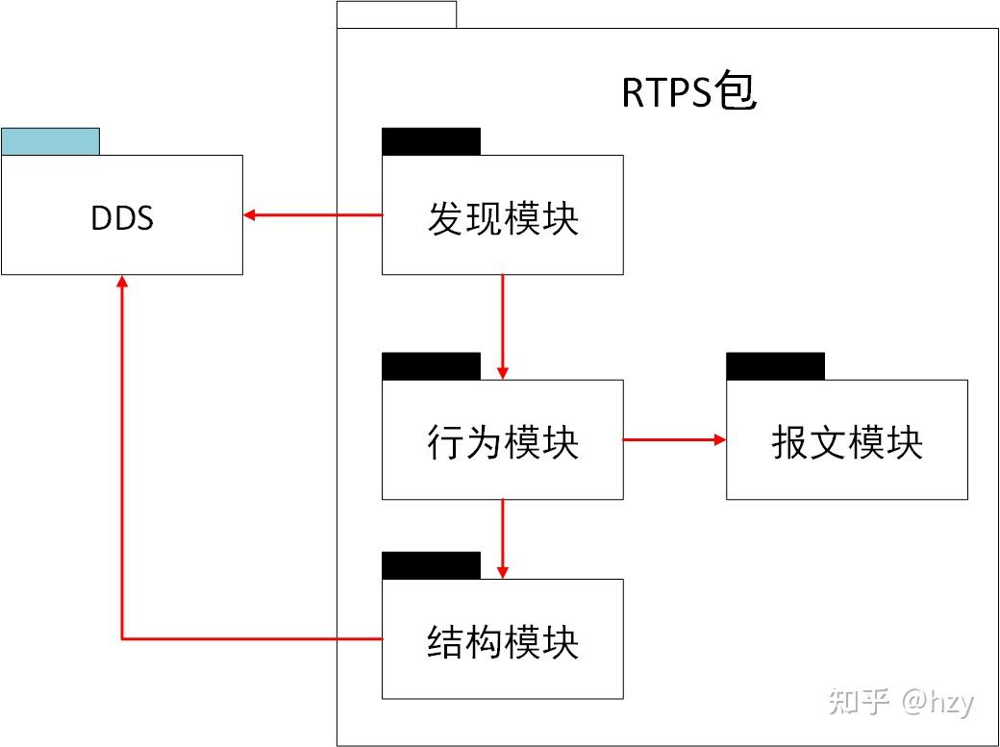

rtps规范内容

## 2. 结构模块

结构模块介绍RTPS规范里面重要的概念以及相关关联关系，并定义一些基础的的数据结构。

### 2.1. 基础的数据结构

| 数据结构名称 | 说明 |
| --- | --- |
| GUID_t | 16个字节的标识，在系统内唯一标识通信实体，由GuidPrefix_t和EntityId_t组成； |
| GuidPrefix_t | 12个字节的标识，在系统内唯一标识参与者实体； |
| EntityId_t | 4个字节的标识，在域参与者内唯一标识实体； |
| SequenceNumber_t | 8字节的整数，唯一标识样本数据； |
| InstanceHandle_t | 16个字节的标识，唯一标识数据实例； |
| Locator_t | 通信地址信息，包含类型、4字节的端口号以及16个字节的地址信息； |
| TopicKind_t | 主题类型，标识关联的数据类型是否含有KEY域； |
| ChangeKind_t | 对数据实例的修改类型，包括：正常、注销、删除； |
| ReliabilityKind_t | 可靠性等级，BEST-EFFORT/RELIABLE |
| ProtocolVersion_t | 2个字节的数据结构标识RTPS的协议版本 |
| VendorId_t | 2个字节的数据结构标识供应商的ID |

### 2.2. 重要概念定义

重要的概念定义及其关系如下图所示：

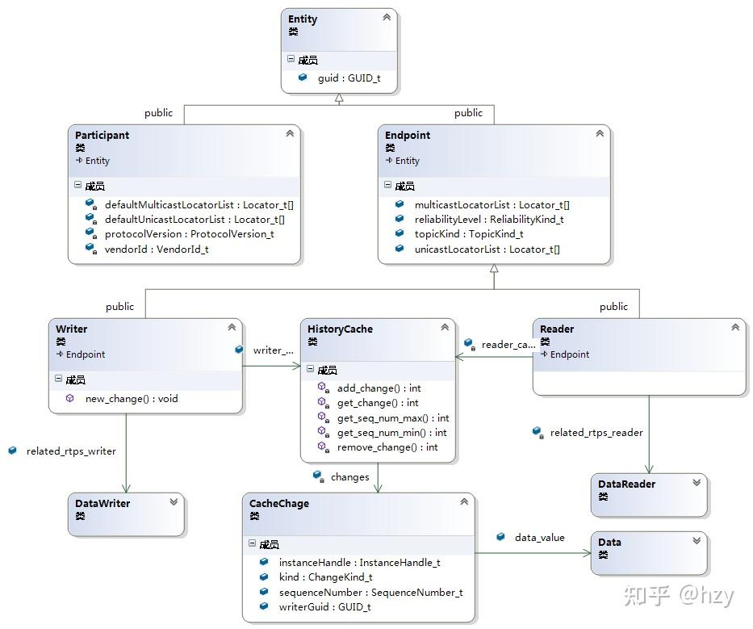

rtps结构模块关系图

| 概念定义 | 说明 |
| --- | --- |
| Entity | 实体，包括：参与者以及通信实体（写者、读者）的共用属性，包含唯一标识； |
| Participant | 参与者，作为通信实体（写者、读者）的父实体，存储协议版本、供应商ID以及默认的地址信息； |
| Endpoint | 通信实体，作为写者以及读者的父类抽象，存储两端共有的信息，包括使用的通信地址、可靠性等级一级主题等级； |
| Writer | 写者，用于发送数据，每个写者关联一个HistoryCache，用于维护发送的数据，并提供接口发送数据； |
| Reader | 读者，用于接收数据，每个读者关联一个HistoryCache，用于维护接收到的数据列表； |
| HistoryCache | 历史数据缓存队列，提供增、删、查的功能，队列中的元素为CacheChange； |
| CacheChange | 描述一个样本数据，包含发送方标识、序列号、所属数据实例以及负载。 |

## 3. 报文模块

### 3.1. 总体结构

报文模块的总体结构如下所示：

- Message，RTPS消息，包含一个消息头（Header）以及1个到多个子消息（SubMessage）；
- Header，RTPS消息头；
- SubMessage，RTPS子消息，作为不同子消息的抽象结构，包括一个子消息头（SubmessageHeader）以及每种不同子消息包含不同的一个到多个子消息元素（SubmessageElement），子消息根据功能上的不同可以分为三类；
- 可靠型，包括：Heartbeat、AckNack、NackFrag；
- 信息型，包括：InfoDestination、InfoTimeStamp、InfoReply以及InfoSource；
- 数据型，包括：Data、Gap、DataFrag；

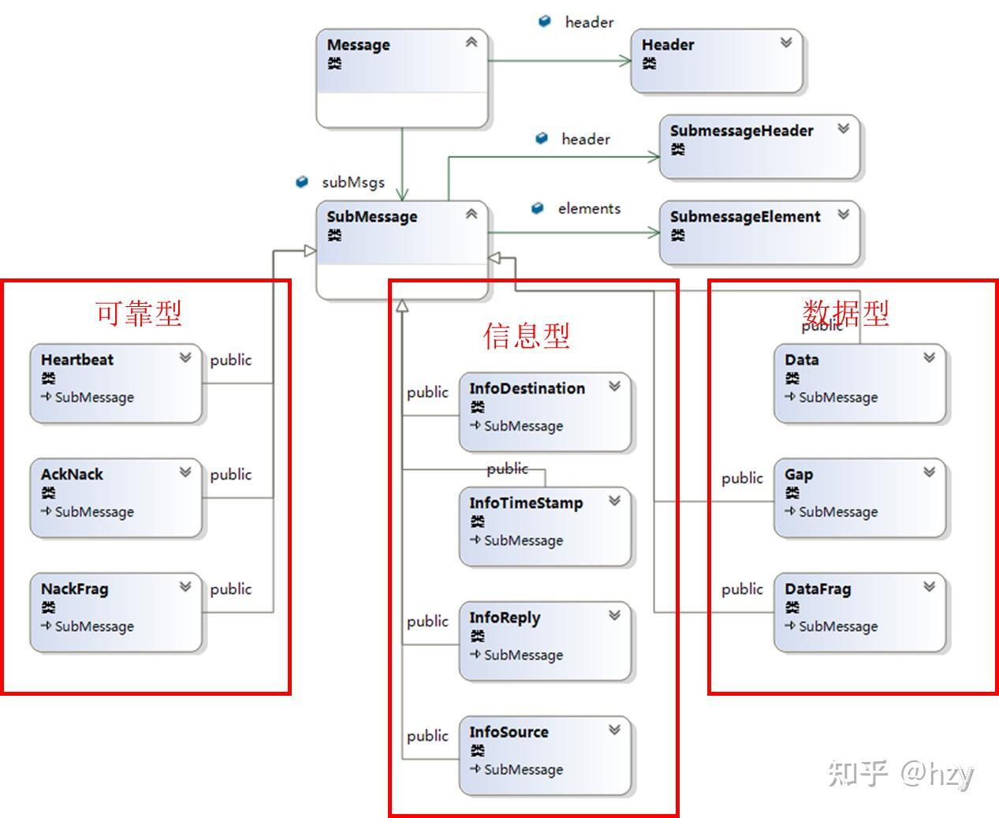

rtps消息结构图

### 3.2. 消息头和子消息头

消息头的结构如下：

- 'R'、'T'、'P'、'S'、4个字节的Magic标志；
- 2个字节的协议版本；
- 2个字节的供应商ID；
- 12个字节的参与者标识，注意这里的标识为报文发送方的域参与者标识，目的域参与者可通过目标端口默认或者信息型子消息指定；

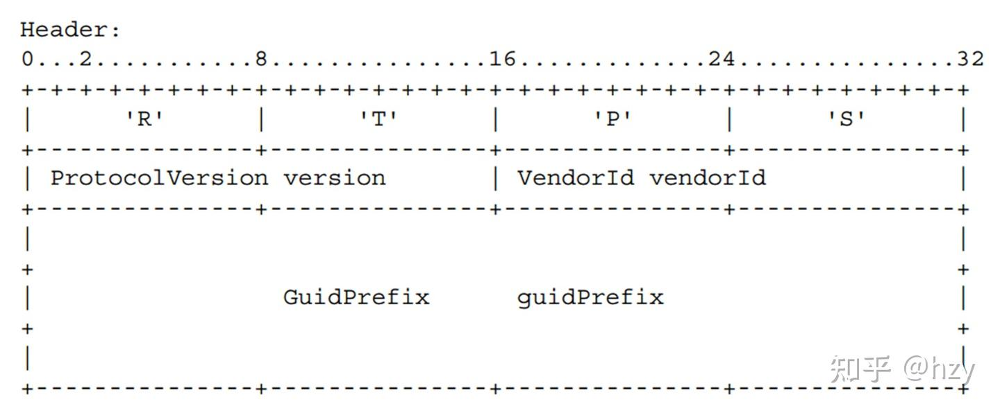

rtps消息头结构

子消息头的结构如下：

- 1个字节的子消息类型；
- 1个字节的子消息标志，除最后一位规定为端序标志，其余位对不同的子消息含义不同；
- 2个字节的子消息长度，值得注意的是，两个字节的长度限制了DDS的子消息长度小于64KB；

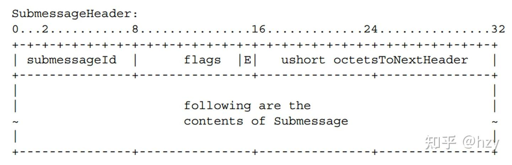

rtps子消息头

### 3.3. 数据型子消息

#### 3.3.1. DATA

DATA报文用于携带用户数据，其结构如下：

- 子消息头；
- 2个字节的扩展标志位；
- 两个字节表示到Inline QoS的长度，固定为16；
- 4个字节的目标实体标识；
- 4个字节的源实体标识；
- 8个字节的数据序列号；
- Inline QoS，可选项，当标志位中设置了QoS时有效，用于携带固定的信息，例如InstanceHandle_t或者状态；
- 负载数据，可选项，只有设置了数据标志位时有效，用于指明序列化方式以及序列化后的负载报文，关于CDR相关的内容可以参见XTypes规范解读。

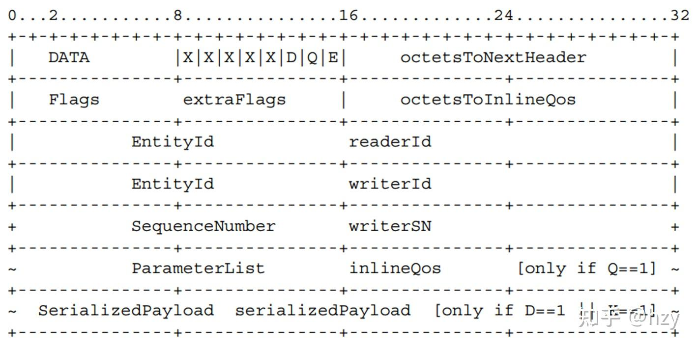

data子消息结构

#### 3.3.2. DATA_FRAG

RTPS规范支持发送大于传输层MTU的样本数据，底层会将一个完整的样本数据拆分构造成多个DATA_FRAG报文，每个DATA_FRAG报文携带一部分的负载数据，DATA_FRAG的报文结构如下，该结构与DATA比较类似，不同的部分如下：

- 4个字节的FragmentNumber表示该子消息携带的起始分片号；
- 2个字节的fragmentsInSubmessage表示该子消息携带的分片个数；
- 2个字节的fragmentSize表示该子消息中的分片大小；
- 4字节的sampleSize表示完整的样本数据大小；

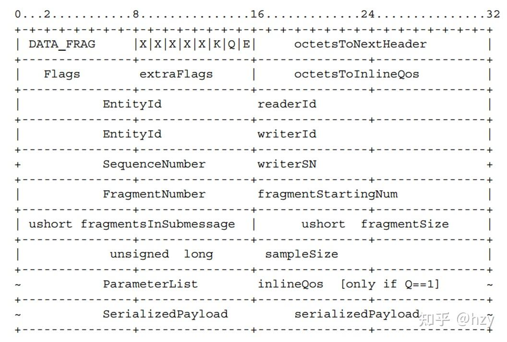

data_frag子消息结构

### 3.4. 可靠型子消息

RTPS协议可在非可靠的传输层（例如：UDP）上实现可靠传输，其基本原理是基于样本序列号的确认重传的机制，基本流程如下：

- 发端通过Heartbeat子消息告知收端本地有效的样本序列号范围；
- 接收端收到HB子消息后，检查本地已经接收到的样本序列号集合与HB中的序列号范围进行对比，通过ACKNACK子消息告知发端缺失的样本序列号；
- 发端通过数据型子消息或者GAP重新发送缺失的序列号；

#### 3.4.1. HEARTBEAT

HEARTBEAT子消息格式如下，发端当前存在[firstSN, lastSN]区间的样本数据：

- firstSN，8字节表示左区间；
- lastSN，8字节表示右区间；
- count，4字节计数，用于接收端保序，即该计数值保证接收端不会处理过期的HB子消息；

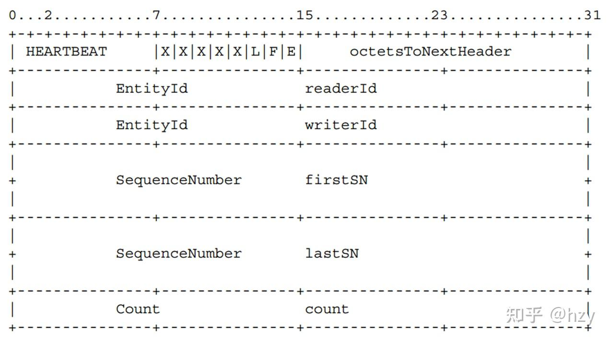

heartbeat子消息结构

#### 3.4.2. ACKNACK

ACKNACK顾名思义，包含正反馈以及负反馈两个部分：

- [1, readerSNState.base-1]区间为正反馈，即小于readerSNState.base的样本都已经确认；
- 在readerSNState.set集合中的样本为负反馈，即在集合中的样本序列号缺失，需要重传；

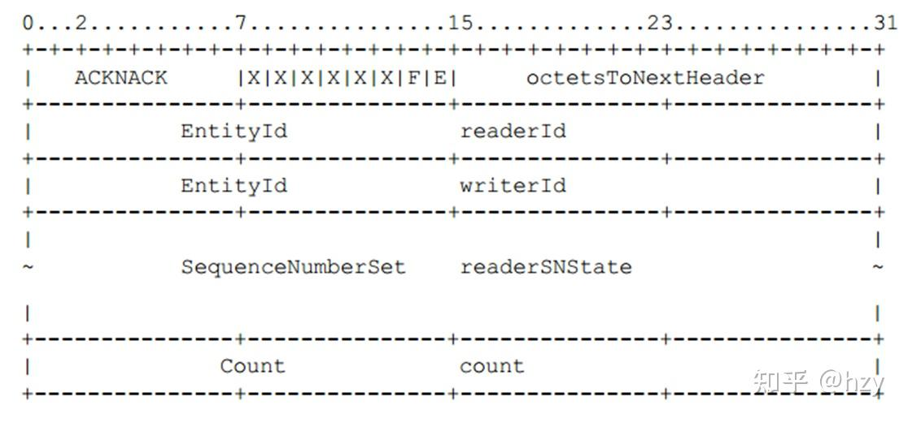

acknack子消息结构

#### 3.4.3. NACKFRAG

NACKFRAG子消息与ACKNACK子消息类似，针对数据分片的情况下某个样本的分片接收状态。

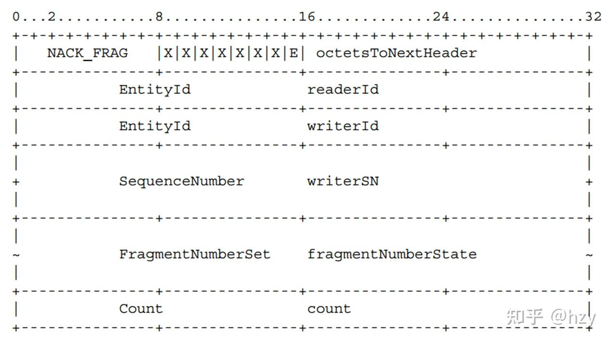

nackfrag子消息结构

#### 3.4.4. GAP

GAP子消息通知收端，某些序列号的样本数据已经不存在了，不要再请求这些序列号，这些序列号包括：

- [gapStart, gapList.base-1]区间的所有样本；
- gapList.set表示的集合中的样本，从第0位表示gapList.base，位为1表示在集合中，位为0表示不在集合中；

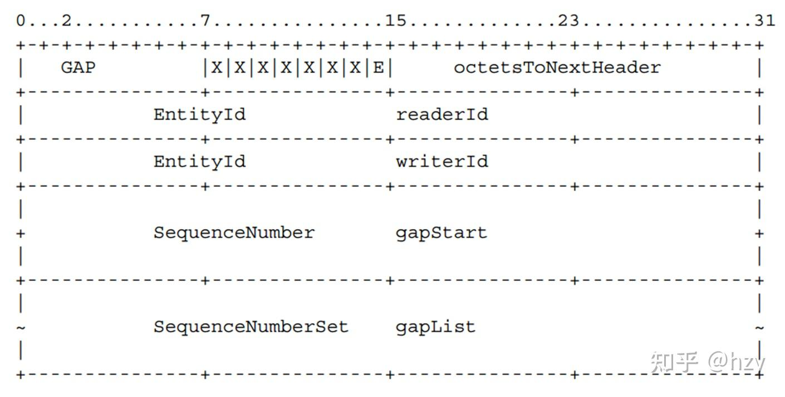

gap子消息结构

### 3.5. 信息型子消息

每个接收端都关联一个接收器，该接收器由Receiver类型表示，信息型子消息用于修改接收端的接收器中的某些状态。

| 状态 | 来源 | 说明 |
| --- | --- | --- |
| sourceVersion | 消息头 | 接收到的消息的协议版本 |
| sourceVendorId | 消息头 | 接收到的消息的供应商ID |
| sourceGuidPrefix | 消息头/InfoSource子消息 | 后续消息的源参与者标识 |
| destGuidPrefix | 默认为本地/InfoDestination | 后续消息的目的参与者标识 |
| timestamp | InfoTimeStamp | 后续子消息的时间戳信息 |
| replyLocatorList | 默认为匹配后保存的源端地址/InfoReply | 回复本消息的目标地址信息 |

## 4. 行为模块

行为模块进一步定义了Writer/Reader的接口及其行为，由于直接实现RTPS接口的产品暂时只看到fastrtps，且个人认为RTPS的接口定义不太完善，行为模块只分享几种典型的行为，简单的理解：

- StatelessWriter对应BEST-EFFORT类型的数据写者；
- StatelessReader对应BEST-EFFORT类型的数据读者；
- StatefulWriter对应RELIABLE类型的数据写者；
- StatefulReader对应RELIABLE类型的数据读者；

### 4.1. StatelessWriter

StatelessWriter的状态机如下：

- IDLE状态，匹配新的远程数据读者后进入IDLE状态；
- PUSHING状态，当有未发送的样本数据时，进入该状态，在该状态下循环发送未发送的样本数据，直到发送完成后进入IDLE状态，仅涉及到DATA以及GAP两类子消息；

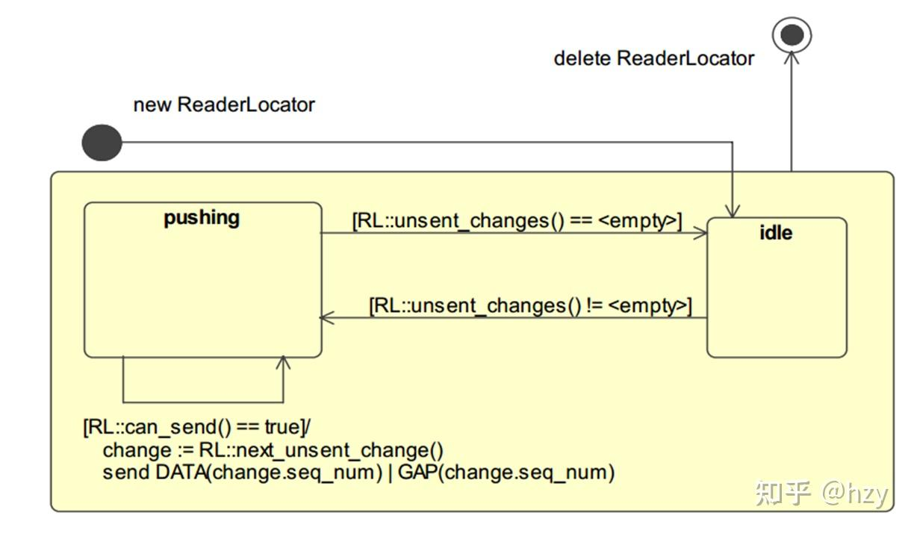

statelesswriter状态机

### 4.2. StatelessReader

StatelessReader的状态机如下：

- 创建读者后进入等待状态，当从底层收到DATA子消息后将相应的负载反序列化并加入到关联的HistoryCache中，直到读者被删除；

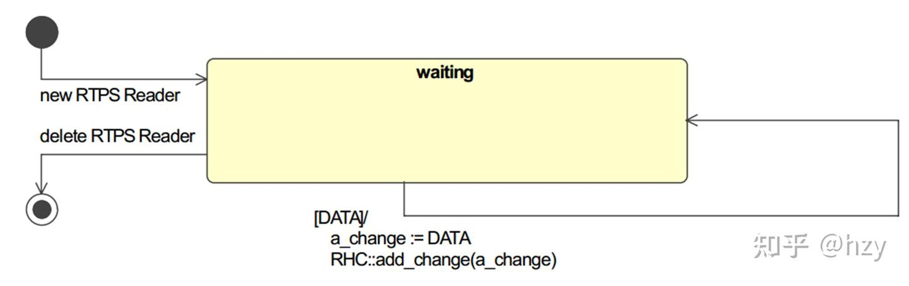

statelessreader状态机

### 4.3. StatefulWriter

StatefulWriter有两个状态机，其中一个为主动状态机，主动状态机相较于StatelessWriter增加了一个状态：

- announcing状态，当存在未被反馈的数据样本时，应该周期性的发送HB子消息来触发读者确认状态；

另一个为被动状态机（由底层消息驱动），其详情如下：

- waiting状态，等待底层接收包含ACKNACK或者NACKFRAG的子消息，当存在负反馈的序列号时进入must_repaire状态；
- must_repair状态，设置正反馈序列号，构造负反馈序列号集合，在响应延迟时间后进入repairing状态；
- repairing状态，通过DATA或者GAP子消息响应请求的序列号样本，当响应完成后进入waiting状态；

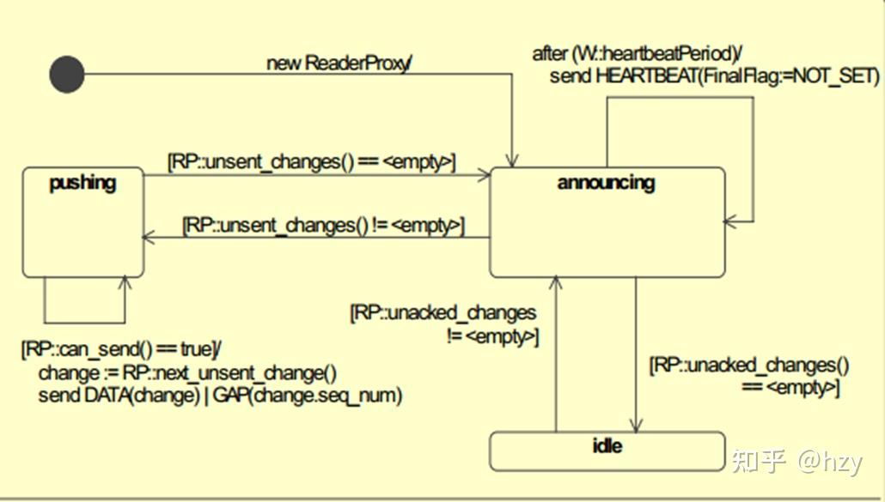

statefulwriter主动状态机

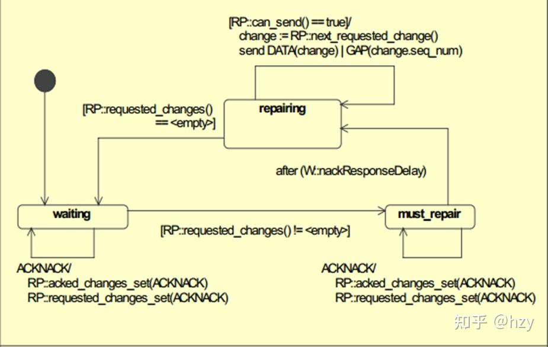

statefulwriter被动状态机

### 4.4. StatefulReader

StatefulReader同样存在两个状态机，其中一个为主动状态机，主动状态机就是可靠重传的过程：

- waiting状态，匹配到关联的writer，当FinalFlag未设置时进入must_send_ack状态；当FinalFlag设置但LivenessFlag未设置时进入may_send_ack状态；
- must_send_ack状态，在响应延迟时间后发送Acknack进入waiting状态；
- may_send_ack状态，当WP不存在reader未接收到的更改时进入waiting状态；存在时进入must_send_ack状态；

另一个为被动状态机（由底层消息驱动），当从底层收到DATA子消息后将相应的负载反序列化并加入到关联的HistoryCache中，直到读者被删除。

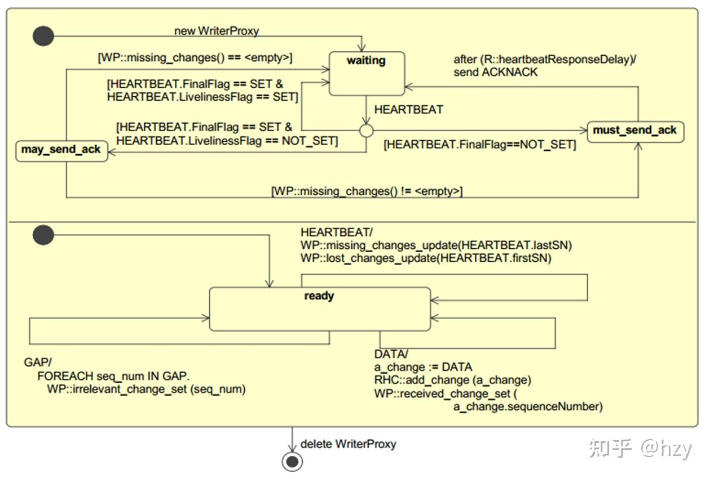

statefulreader状态机

## 5. 发现模块

发现模块是DDS“纯分布式架构”的基础，每个应用上的DDS实体能够通过纯分布式的方式获取到系统内其他DDS实体的信息，并根据这些信息进行基于主题的按需分发。发现模块定义了两个协议：

- 域参与者发现协议（Participant Discovery Protocol，PDP），用于域参与者之间的互相感知；
- 端点发现协议（Endpoint Discovery Protocol，EDP），在PDP的基础上互相感知参与者下写者与读者信息；

### 5.1. 简单域发现协议（SPDP）

SPDP协议依赖于UDP组播技术，UDP组播适用于在发端不知道接收者的数量、位置（IP地址）的情况下数据传输，协议规定的组播组信息如下，每个参与者使能后都会加入指定的组播组并周期性向该组播组中发送包含自身信息的数据：

- 239.255.0.1
- 端口计算公式：7400+domain_id*250

Spdp协议定义了每个参与者必须创建一对内置写者/读者实体，其信息如下：

| 名称 | SPDPBuiltinParticipantWriter | SPDPBuiltinParticipantReader |
| --- | --- | --- |
| 主题名 | DCPSParticipant | DCPSParticipant |
| 类型名 | ParticipantBuiltinTopicData | ParticipantBuiltinTopicData |
| QoS | Stateless等 | Stateless等 |
| EntityId_t | {\{00,01,00\},c2} | {\{00,01,00\},c7} |
| 说明 | 用于周期性发送自身包含自身信息的rtps消息 | 用于监听处理 |

ParticipantBuiltinTopicData的结构如下图所示，其中比较重要的成员包括：

- metatrafficUnicastLocator，告知其他参与者向这个地址发送SEDP规范相关的内置消息；
- defaulttrafficUnicastLocator，告知其他参与者向这个地址发送自定义主题消息；
- leaseDuration，告知其他参与者在这个时间内未收到心跳报文可判定自身失去活性；

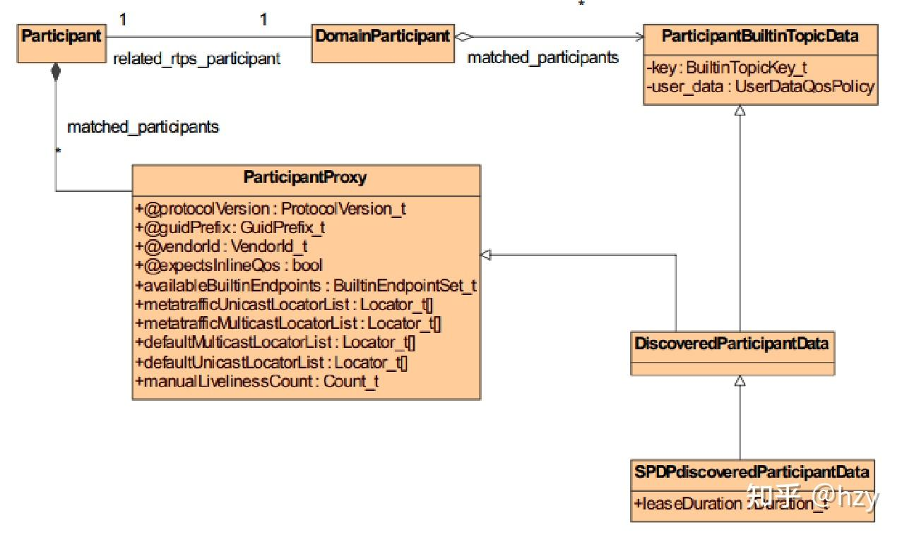

ParticipantBuiltinTopicData结构

### 5.2. 简单端点发现协议（SEDP）

通过SPDP协议，域参与者之间相互感知，接下来需要通过SEDP协议来互相感知彼此的子实体（主题、数据写者、数据读者），与本地的主题（及相关数据写者、数据读者）进行匹配，从而完成主题数据的按需分发，SEDP通常基于UDP单播，地址为自动获取的本机地址，端口的计算方式：7400+domain\_id\*250+10+participant\_id\*2，同理SEDP定义至少两对内置的数据写者以及数据读者分别用于完成数据写者以及数据读者的互相发现，详细信息如下表：

| 名称 | SEDPBuiltinPublicationsWriter | SEDPBuiltinPublicationsReader |
| --- | --- | --- |
| 主题名 | DCPSPublication | DCPSPublication |
| 类型名 | DiscoveredWriterData | DiscoveredWriterData |
| QoS | {Stateful、内存持久化等} | {Stateful、内存持久化等} |
| EntityId_t | {\{00,00,03\},c2} | {\{00,00,03\},c7} |
| 说明 | 用于发送数据写者相关信息 | 用于接收数据写者相关信息 |

| 名称 | SEDPBuiltinSubscriptionsWriter | SEDPBuiltinSubscriptionsReader |
| --- | --- | --- |
| 主题名 | DCPSSubscription | DCPSSubscription |
| 类型名 | DiscoveredReaderData | DiscoveredReaderData |
| QoS | {Stateful、内存持久化等} | {Stateful、内存持久化等} |
| EntityId_t | {\{00,00,04\},c2} | {\{00,00,04\},c7} |
| 说明 | 用于发送数据读者相关信息 | 用于接收数据读者相关信息 |

DiscoveredWriterData以及DiscoveredReaderData所包含的信息如下图所示，其中重要的成员包括：

- type_name，关联主题所关联的数据类型；
- topic_name，关联主题的名称；
- remoteWriterGuid/remoteReaderGuid，代表实体的唯一标识；
- 关联的QoS的信息；

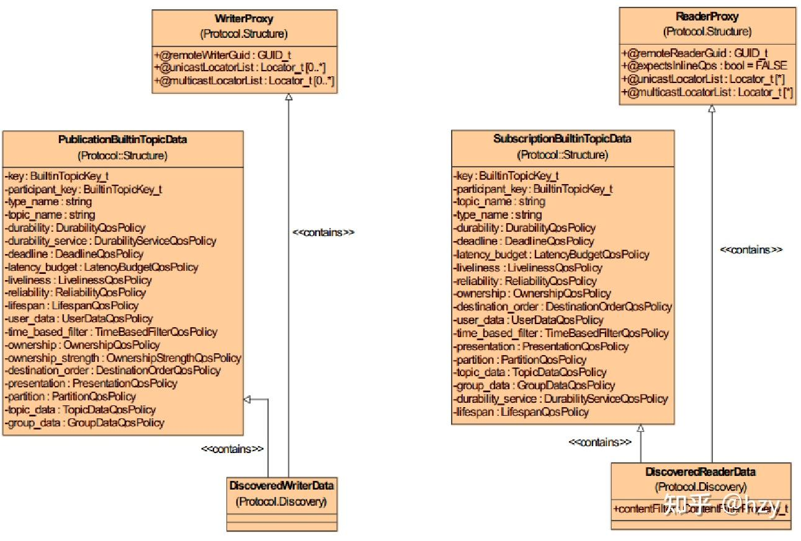

DiscoveredWriter/ReaderData结构

