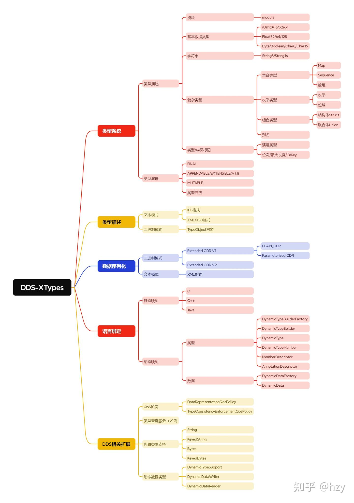
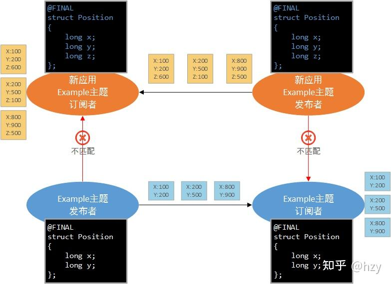
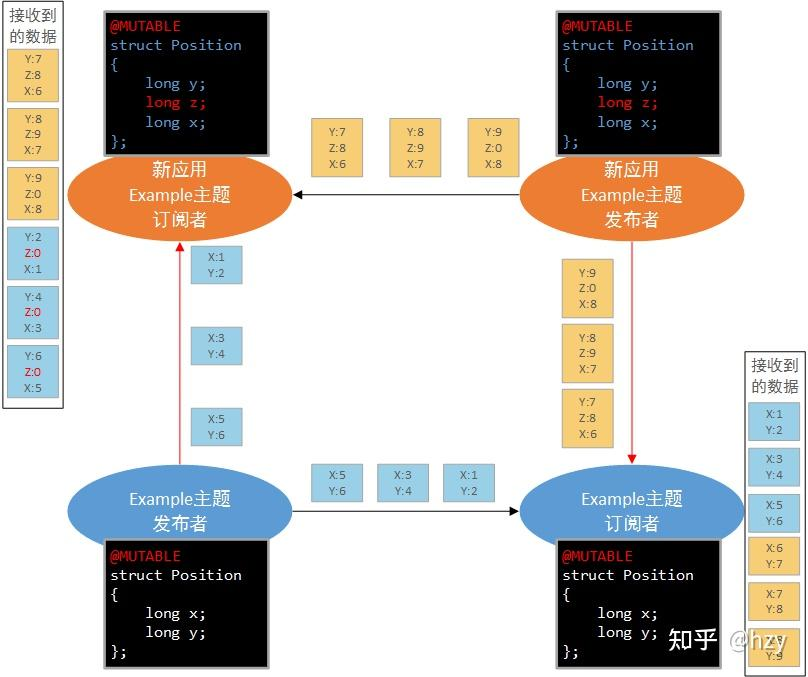
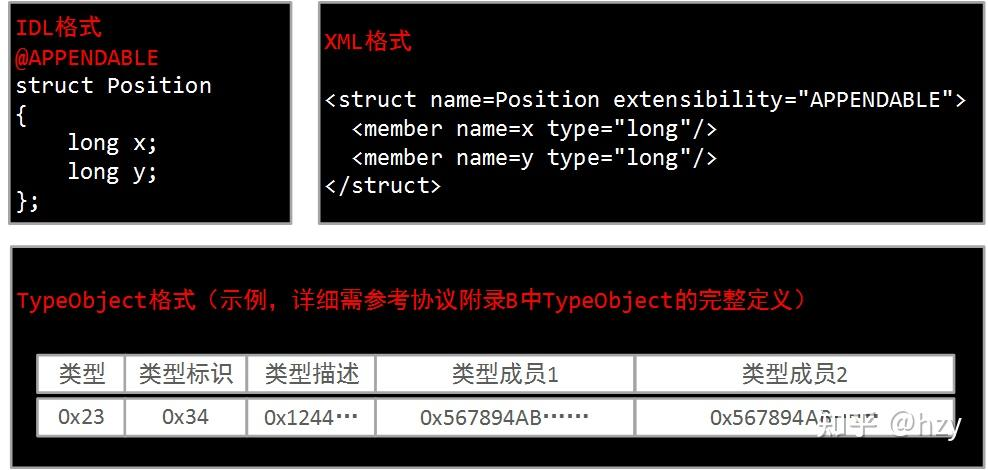
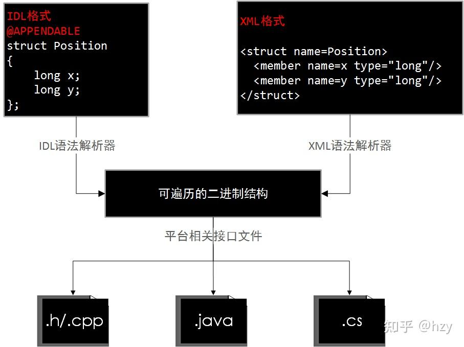
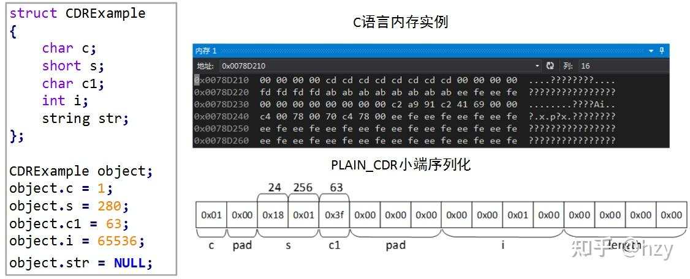
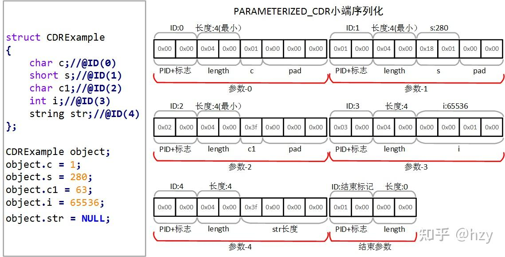
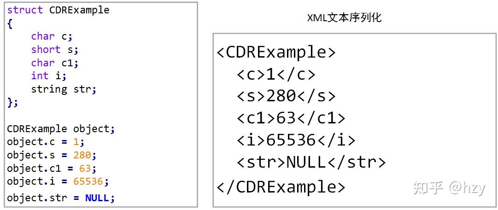

## 1. 概述

_问：为什么DDS规范要定义这么复杂的一个类型规范？_

_答：这个问题可以在[概述]里面的1.3.1章节中找到答案，因为DDS主题需关联某个特定的数据类型，并具备以下这些能力使得DDS表现的像能够理解业务数据一样。_

- 自定义类型相关的发送/接收接口，即提交给DDS和从DDS中获取的是主题关联的自定义数据结构对象。
    - 优势
        - 序列化/反序列化的工作从应用下沉到中间件，由中间件考虑端序/对齐/不同语言类型的转换；
        - 类型检查，在编译期即可检查出部分问题；
    - 劣势
        - 使用复杂，即便是简单的收发也需要IDL编译器编译支持代码；
- 数据筛选，DDS提供类似于数据库的实时数据存储与查询的功能，包括：
    - 将主题数据按照key值组织，比如订阅端可以仅读取特定key值的数据；
    - 内容过滤，即订阅端可以配置只关心某个成员范围之间的值，DDS将自动过滤不属于这个范围的主题数据；
- 类型规范是不同DDS产品互联互通的基础
    - 产品遵循相同的规范使得能够支持的数据类型互认；
    - 数据样本序列化方式规范使得A厂家的DDS产品序列化的数据可以由B厂家的DDS产品反序列化还原成相同类型的样本数据；

以数据为中心是DDS与其他消息中间件的一个重要的区别。DDS-XTypes是实现以数据为中心的核心协议。最新版本的DDS-XTypes规范是2020年发布的V1.3版本，大家可以在[这个页面](https://www.omg.org/spec/DDS-XTypes/)找到DDS-XTypes协议及其附件。DDS-XTypes规范的主要内容参见下图，主要内容包括：

- 类型系统，支持的数据类型及其语法规则，更进一步的描述了类型如何演进；
- 类型描述，采用何种格式来描述数据类型；
- 数据序列化， 采用什么方式序列化数据类型实例；
- 语言绑定，如何映射为特定的开发语言；
- DDS相关扩展，描述该规范与DCPS规范如何关联并扩展DCPS规范。

DDS-XTypes规范内容大纲

## 2. 类型系统

### 2.1. 类型描述

类型描述定义开发语言无关的各种类型的语言以及结构，具体包含的类型参见上图，协议中规定DDS主题能够关联的数据类型只包括：结构体struct以及联合体union，其他类型则作为这两种聚合类型的成员。

除了常规的类型/成员定义外，类型系统中还为类型或者成员添加了一些标签来提供额外的信息，常见的几个标签参见下表。

| 标签 | 作用对象 | 说明 |
| --- | --- | --- |
| Extensibility | 类型 | 用于表明该类型的可扩展性，详见2.2. |
| Nested | 类型 | 是否直接关联到DDS主题 |
| key | 成员 | 表明成员是否为键值 |
| optional | 成员 | 表明成员是否为可选 |
| id | 成员 | 指定成员的唯一ID |
| bound | string/sequence/map成员 | 表明变长结构的长度上界，主要用于空间管理 |

### 2.2. 类型演进

DDS可扩展性分为3种，详见下表，为什么取名叫“类型演进”，因为基于APPENDABLE/MUTABLE可扩展性类型，原有系统无需做任何的代码、配置的修改，即可与新的系统（使用迭代后的新的数据类型）进行数据交互。

| 可扩展性 | 说明 |
| --- | --- |
| FINAL | 不可扩展，类型结构必须完全一致才能相互交换数据，用于保护已有系统。 |
| APPENDABLE | 可追加，这种类型是默认的类型，新的类型是基于老的类型在后面添加成员得到，这种模式下新老数据结构关联的主题能够相互交换数据。 |
| MUTABLE | 可随意变换，新的类型可将老的类型重新排序组合以及添加新的成员得到，这种模式下新老数据结构关联的主题能够相互交换数据。 |

FINAL可扩展性示意图

上图中下面蓝色部分代表已有运行系统，上面的橙色部分代表新建的系统，新建的发布/订阅应用将位置信息从原有的2个坐标修改为3个坐标，此时由于原有系统设置为FINAL的保护状态，新的应用无法集成到老的系统中去。

APPENDABLE可扩展性示意图

上图中下面蓝色部分代表已有运行系统，上面的橙色部分代表新建的系统，新建的发布/订阅应用将位置信息从原有的2个坐标修改为3个坐标，此时由于类型系统设置为APPENDABLE可扩展状态，老的应用不修改任何的配置以及代码，即可把新的发布/订阅应用集成到原有的系统中，老的订阅者（右下）将接收到新的发布者发布的数据，其中多出的z成员将被忽略，而新的订阅者应用（左上）将接收到老的发布端者发布的数据，其中缺少的z成员将赋予默认的值。

MUTABLE可扩展性示意图

上图中下面蓝色部分代表已有运行系统，上面的橙色部分代表新建的系统，新建的发布/订阅应用将位置信息将原有的x、y坐标打乱并在中间插入一个新的成员z，此时由于类型系统设置为MUTABLE可扩展状态，老的应用不修改任何的配置以及代码，即可把新的发布/订阅应用集成到原有的系统中，老的订阅者（右下）将接收到新的发布者发布的数据，其中多出的z成员将被忽略，而新的订阅者应用（左上）将接收到老的发布端者发布的数据，其中缺少的z成员将赋予默认的值。

介绍到这里可能会产生一个疑问：既然能够支持MUTABLE类型，那所有的类型都设计成可变的类型，系统的可扩展性不就可以得到保证吗，为什么还需要支持前面两个类型？答案总结在下面的这张不同类型的优劣势中，不同类型可扩展性实现的关键技术在数据序列化中介绍。

| 可扩展性 | 优势 | 劣势 |
| --- | --- | --- |
| FINAL | 1、首先是安全，类似于Java里面把一个类声明为final禁止其他类型继承扩展；2、固定结构下数据序列化/反序列化效率高 | 无可扩展性 |
| MUTABLE | 具备很好的可扩展性 | 结构可变带来底层序列化/反序列化需要携带更多的额外信息，导致效率变低 |
| APPENDABLE | 1、具备一定的可扩展性；2、接近于固定结构序列化/反序列化效率高 | 可扩展性有限 |

## 3. 类型描述

类型描述很好理解，就是选用一种载体把类型系统中定义出来的类型表达出来，这种表达可以有很多种：

- 文本模式，人类友好的表达模式  
    - IDL描述，这时一种平台（语言、处理器、操作系统）无关的描述方式，说起来高大上起始就是自定义了一套类C的语法规格来描述类型，IDL本身是平台无关的，那么必然还需要配套的IDL到不同开发语言/平台的映射规范，这些都是参考已有的OMG Corba规范的内容，本质上不属于ＯＭG DDS规范；
    - 当所有系统仅涉及某一个平台或者开发语言时，可以直接采用相应的开发语言来描述，比如：使用C结构体定义；
    - XML/JSON描述，采用常用的文本描述语言来描述结构；
- 二进制模式，机器友好的表达模式，无需进行文本处理即可遍历获得数据结构的信息  
    - TypeObject二进制结构；
    - 早期版本RTI公司NDDS的TypeCode结构；

不同的类型描述示意图

### 3.1. IDL编译器

DDS需要负责自定义数据类型的序列化以及反序列化过程，那么这个过程必然涉及到对自定义数据结构的遍历，再针对每个成员进行特定的序列化/反序列化操作，这个过程需要一个工具来自动化实现，这个工具我们把它叫做编译器，针对不同类型描述方式会需要多种编译器，例如：IDL编译器、XML编译器，主要是第一阶段功能不同，后面的阶段需针对不同的开发语言、平台生成平台相关的支持文件，详细参见下表。

DDS编译器主要功能逻辑图

| 分类 | 说明 |
| --- | --- |
| 样本生命周期管理 | 创建、初始化、回收、拷贝自定义数据对象（样本） |
| 序列化/反序列化 | 将自定义对象序列化为RTPS子消息元素（二进制透明报文）、从RTPS报文中反序列化构造自定义对象 |
| 二进制类型描述 | 遍历二进制结构构造协议规定的TypeObject对象供底层使用 |
| 类型相关的接口 | 自动生成自定义类型相关的数据发送（DataWriter::write）、接收（DataWriter::read/take系列）接口 |

## 4. 数据序列化

### 4.1. PLAIN_CDR

PLAIN_CDR是本协议提供的一种二进制序列化算法，仅序列化数据内容，具备较高的空间使用效率，数据结构在自动发现阶段通过内置数据中的TypeObject对象交换一次。PLAIN_CDR是FINAL以及APPENDABLE类型的默认序列化方式，其算法要点如下：

- 基本数据类型：直接拷贝对应的字节大小到对应的序列化地址空间
- 注意地址对齐（对齐大小=被序列化的类型大小）；
- 注意大小端转换，当本机端序与要求的端序不同时，需要先转换端序再拷贝；
- string/sequence/map等变长成员：先序列化4字节长度信息，再依次序列化元素；
- 结构体：依次序列化成员，深度优先；

PLAIN_CDR示例

上图为CDRExample自定义类型的对象object的序列化实例，其中二进制为序列化后结果，下面为对应的成员或者对齐，上面为其对应的值，可以看到s成员进行了2字节对齐，i成员进行了4字节对齐，str成员携带了字符串长度0。

### 4.2. PARAMETERIZED CDR

PARAMETERIZED CDR是本协议提供的另一种二进制序列化算法，它将样本序列化为一个Parameter（参数）列表，其中每个参数由参数头和参数体构成，其中参数头包括部分成员信息，比如成员的编号（ID）、属性（是否为key/optional等），参数体包含成员的具体值，可以看到Parameterized CDR相对于PLAIN_CDR而言对每个成员都额外添加了一个参数头，带来的好处是：无需按照严格的定义顺序序列化，也可以添加或者删除成员，坏处在于序列化的效率降低了，该类型可用于实现MUTABLE可扩展性方式。

PARAMETERIZED-CDR示例

### 4.3. XML序列化

XML序列化是本协议提供的一种文本序列化算法，具备较低的空间使用效率，主要包含如下消耗：

- 每个样本中都包含完整的成员信息；
- 文本在某些场景下具备较低的封装效率，例如封装值为10000000的整型，需要8个字节，而二进制实际仅需4个字节；

XML序列化示例

### 4.4. 性能对比

CDR和比较流行的其他序列化库的对比：Google ProtoBuf、Apache Thrift性能对比，这个课题比较复杂，在互联网上只搜索到eProsima的一篇技术文章，但是现在打不开了，后续有时间再全面进行对比。

## 5. 语言绑定

这个章节定义了两种使用自定义数据类型的方式:

- 静态：常见的方式，通过IDL等方式描述自定义数据类型，通过DDS编译器生成支撑文件，将生成的文件与业务代码进行联编，这种方式比较繁杂并且修改类型时需要替换支撑文件并重编。
- 动态：通过本规范提供的DynamicTypeBuilder以及DynamicTypeData相关的API接口通过代码构造类型，并使用动态通用序列化/反序列化、生命周期管理等方法，这块内容较为零散，这里不展开分析，有兴趣的可以私信讨论。

## 6. DDS扩展

这一章主要提一下用户用DDS时并不是必须使用IDL自定义数据类型，本协议为DDS提供了一些常用的内置数据类型，包括：

- 字符串；
- 带key的字符串；
- 透明缓冲区；
- 带key的透明缓冲区；

当用户能够自己管理序列化以及反序列化时，可以跳过自定义数据结构的过程，直接使用内置的数据类型进行开发，简化整个开发的流程。

