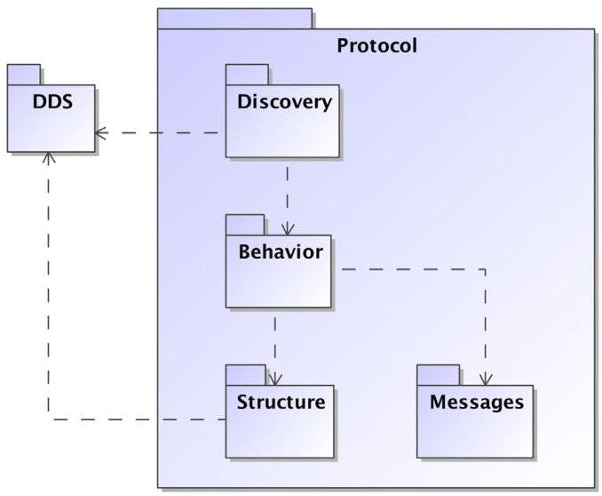

# Overview

This specification defines an interoperability wire protocol for DDS. Its purpose and scope are to ensure that applications based on different vendors’ implementations of DDS can interoperate.

## 7.1 Introduction

The recently-adopted Data-Distribution Service specification defines an Application Level Interface and behavior of a Data-Distribution Service (DDS) that supports Data-Centric Publish-Subscribe (DCPS) in realtime systems. The DDS specification used a Model-Driven Architecture (MDA) approach to precisely describe the Data-Centric communications model specifically:
- How the application models the data it wishes to send and receive.
- How the application interacts with the DCPS middleware and specifies the data it wishes to send and receive as well as the quality of service (QoS) requirements.
- How data is sent and received (relative to the QoS requirements).
- How the applications access the data.
- The kinds of feedback the application gets from the state of the middleware.

The DDS specification also includes a platform specific mapping to IDL and therefore an application using DDS is able to switch among DDS implementations with only a re-compile. DDS therefore addresses ‘application portability.’

The DDS specification does not address the protocol used by the implementation to exchange messages over transports such as TCP/UDP/IP, so different implementations of DDS will not interoperate with each other unless vendor-specific “bridges” are provided. The situation is therefore similar to that of other messaging API standards such as JMS.

With the increasing adoption of DDS in large distributed systems, it is desirable to define a standard “wire protocol” that allows DDS implementations from multiple vendors to interoperate. The desired “DDS wire protocol” should be capable of taking advantage of the QoS settings configurable by DDS to optimize its use of the underlying transport capabilities. In particular, the desired wire protocol must be capable of exploiting the multicast, best-effort, and connection less nature of many of the DDS QoS settings.

### 7.2 Requirements for a DDS Wire-protocol

In network communications, as in many other fields of engineering, it is a fact that “one size does not fit all.” Engineering design is about making the right set of trade-offs, and these trade-offs must balance conflicting requirements such as generality, ease of use, richness of features, performance, memory size and usage, s cal ability, determinism, and robustness. These trade-offs must be made in light of the types of information flow (e.g., periodic vs. bursty, state-based vs. event-based, one-to-many vs. request-reply, best-effort vs. reliable, small data-values vs. large files, etc.), and the constraints imposed by the application and execution platforms.Consequently, many successful protocols have emerged such as HTTP, SOAP, FTP, DHCP, DCE, RTP, DCOM, and CORBA. Each of these protocols fills a niche, providing well- tuned functionality for specific purposes or application domains.

The basic communication model of DDS is one of unidirectional data exchange where the applications that publish data “push” the relevant data updates to the local caches of co-located subscribers to the data. This information flow is regulated by QoS contracts implicitly established between the Data Writers and the Data Readers. The DataWriter specifies its QoS contract at the time it declares its intent to publish data and the DataReader does it at the time it declares its intent to subscribe to data. The communication patterns typically include many-to-many style configurations. Of primary concern to applications deploying DDS technology is that the information is distributed in an efficient manner with minimal overhead. Another important requirement is the need to scale to hundreds or thousands of subscribers in a robust fault-tolerant manner.

The DDS specification prescribes the presence of a built-in discovery service that allows publishers to dynamically discover the existence of subscribers and vice-versa and performs this task continuously without the need to contact any name servers.
The DDS specification also prescribes that the implementations should not introduce any single points of failure. Consequently, protocols must not rely on centralized name servers or centralized information brokers.

The large scale, loosely-coupled, dynamic nature of applications deploying DDS and the need to adapt to emerging transports require certain flexibility on the data-definition and protocol such that each can be evolved while preserving backwards compatibility with already deployed systems.

### 7.3 The RTPS Wire-protocol

The Real-Time Publish Subscribe (RTPS) protocol found its roots in industrial automation and was in fact approved by the IEC as part of the Real-Time Industrial Ethernet Suite IEC-PAS-62030. It is a field proven technology that is currently deployed worldwide in thousands of industrial devices.

RTPS was specifically developed to support the unique requirements of data-distributions systems. As one of the application domains targeted by DDS, the industrial automation community defined requirements for a standard publish- subscribe wire-protocol that closely match those of DDS. As a direct result, a close synergy exists between DDS and the RTPS wire-protocol, both in terms of the underlying behavioral architecture and the features of RTPS.

The RTPS protocol is designed to be able to run over multicast and connection less best-effort transports such as UDP/IP. The main features of the RTPS protocol include:
- Performance and quality-of-service properties to enable best-effort and reliable publish-subscribe communications for real-time applications over standard IP networks.
- Fault tolerance to allow the creation of networks without single points of failure.
- Extensibility to allow the protocol to be extended and enhanced with new services without breaking backwards compatibility and interoperability.
- Plug-and-play connectivity so that new applications and services are automatically discovered and applications can join and leave the network at any time without the need for reconfiguration.
- Config ur ability to allow balancing the requirements for reliability and timeliness for each data delivery.
- Modularity to allow simple devices to implement a subset of the protocol and still participate in the network.
- S cal ability to enable systems to potentially scale to very large networks.
- Type-safety to prevent application programming errors from compromising the operation of remote nodes.

The above features make RTPS an excellent match for a DDS wire-protocol. Given its publish-subscribe roots, this is not a coincidence, as RTPS was specifically designed for meeting the types of requirements set forth by the DDS application domain.

This specification defines the message formats, interpretation, and usage scenarios that underlie all messages exchanged by applications that use the RTPS protocol.

### 7.4 The RTPS Platform Independent Model (PIM)

The RTPS protocol is described in terms of a Platform Independent Model (PIM) and a set of PSMs.

The RTPS PIM contains four modules: Structure, Messages, Behavior, and Discovery. The Structure module defines the communication endpoints. The Messages module defines the set of messages that those endpoints can exchange. The Behavior module defines sets of legal interactions (message exchanges) and how they affect the state of the communication endpoints. In other words, the Structure module defines the protocol “actors,” the Messages module the set of “grammatical symbols,” and the Behavior module the legal grammar and semantics of the different conversations. The Discovery module defines how entities are automatically discovered and configured.

In the PIM, the messages are defined in terms of their semantic content. This PIM can then be mapped to various Platform-Specific Models (PSMs) such as plain UDP or CORBA-events.

### 7.4.1 The Structure Module

Given its publish-subscribe roots, RTPS maps naturally to many DDS concepts. This specification uses many of the same core entities used in the DDS specification. As illustrated in Figure 7.2, all RTPS entities are associated with an RTPS domain, which represents a separate communication plane that contains a set of Participants . A Participant contains Groups which contain local Endpoints.There are two kinds of endpoints: Readers and Writers . Readers and Writers are the actors that communicate information by sending RTPS messages. Writers inform of the presence and send locally available data on the Domain to the Readers which can request and acknowledge the data.

The Actors in the RTPS Protocol are in one-to-one correspondence with the DDS Entities that are the reason for the communication to occur. This is illustrated in Figure 7.3.

The Structure module is described in 8.2.

### 7.4.2 The Messages Module

The messages module defines the content of the atomic information exchanges between RTPS Writers and Readers. Messages are composed of a header followed by a number of Sub messages, as illustrated in Figure 7.4.Each Submessage is built from a series of Submessage elements. This structure is chosen to allow the vocabulary of Sub messages and the composition of each Submessage to be extended while maintaining backward compatibility.

The Messages module is discussed at length in 8.3.

### 7.4.3 The Behavior Module

The Behavior module describes the allowed sequences of messages that can be exchanged between RTPS Writers and Readers as well as the timings and changes in the state of the Writer and the Reader caused by each message.

The required behavior for interoperability is described in terms of a minimum set of rules that an implementation must follow in order to be interoperable. Actual implementations may exhibit different behavior beyond these minimum requirements, depending on how they wish to trade-off s cal ability, memory requirements, and bandwidth usage.

To illustrate this concept, the Behavior module defines two reference implementations. One reference implementation is based on State ful Writers and State ful Readers , the other on Stateless Writers and Stateless Readers , as illustrated in Figure 7.2 - RTPS Structure Module. Both reference implementations satisfy the minimum requirements for interoperability, and are therefore interoperable, but exhibit slightly  different behavior due to the difference in information they store on matching remote entities. The behavior of an actual implementation of the RTPS protocol may be an exact match or a combination of that of the reference implementations.

### 7.4.4 The Discovery Module

The Discovery module describes the protocol that enables Participants to obtain information about the existence and attributes of all the other Participants and Endpoints in the Domain . This meta traffic enables every Participant to obtain a complete picture of all Participants , Readers and Writers in the Domain and configure the local Writers to communicate with the remote Readers and the local Readers to communicate with the remote Writers.

Discovery is a separate module. The unique needs of Discovery, namely the transparent plug-and-play dissemination of all the information needed to associate matching Writers and Readers make it unlikely that a single architecture or protocol can fulfill the extremely variable s cal ability, performance, and embed d ability needs of the various heterogeneous networks where DDS will be deployed. Henceforth, it makes sense to introduce several discovery mechanisms ranging from the simple and efficient (but not very scalable), to a more complex hierarchical (but more scalable) mechanism.

The Discovery module is described in 8.5.

### 7.5 The RTPS Platform Specific Model (PSM)

A Platform Specific Model maps the RTPS PIM to a specific underlying platform. It defines the precise representation in bits and bytes of all RTPS Types and Messages and any other information specific to the platform.

Multiple PSMs may be supported, but all implementations of DDS must at least implement the PSM on top of UDP/IP, which is presented in Clause 9.

### 7.6 The RTPS Transport Model

RTPS supports a wide variety of transports and transport QoS. The protocol is designed to be able to run on multicast and best-effort transports, such as UDP/IP and requires only very simple services from the transport.In fact, it is sufficient that the transport offers a connection less service capable of sending packets best-effort.That is, the transport need not guarantee each packet will reach its destination or that packets are delivered inorder. Where required, RTPS implements reliability in the transfer of data and state above the transport interface. This does not preclude RTPS from being implemented on top of a reliable transport. It simply makes it possible to support a wider range of transports.

If available, RTPS can also take advantage of the multicast capabilities of the transport mechanism, where one message from a sender can reach multiple receivers. RTPS is designed to promote determinism of the underlying communication mechanism. The protocol provides an open trade-off between determinism and reliability.

The general requirements RTPS poses on the underlying transport can be summarized as follows:
- The transport has a generalized notion of a unicast address (shall fit within 16 bytes).
- The transport has a generalized notion of a port (shall fit within 4 bytes), e.g., could be a UDP port, an offset in a shared memory segment, etc.
- The transport can send a datagram (uninterpreted sequence of octets) to a specific address/port.
- The transport can receive a datagram at a specific address/port.
- The transport will drop m essages if incomplete or corrupted during transfer (i.e., RTPS assumes messages are complete and not corrupted).
- The transport provides a means to deduce the size of the received message.
This page intentionally left blank.

## 8 Platform Independent Model (PIM)

### 8.1 Introduction

This clause defines the Platform Independent Model (PIM) for the RTPS protocol. Subsequent clauses map the PIM to a variety of platforms, the most fundamental one being native UDP packets.

The PIM describes the protocol in terms of a “virtual machine.” The structure of the virtual machine is built from the classes described in 8.2, which include Writer and Reader endpoints. These endpoints communicate using the messages described in 8.3. Sub clause 8.4 describes the behavior of the virtual machine, i.e., what message exchanges take place between the endpoints. It lists the requirements for interoperability and defines two reference implementations using state- diagrams. Sub clause 8.5 defines the discovery protocol used to configure the virtual machine with the information it needs to communicate with its remote peers. Sub clause 8.6 describes how the protocol can be extended for future needs. Finally, 8.7 describes how to implement DDS QoS and some advanced DDS features using RTPS.

The only purpose of introducing the RTPS virtual machine is to describe the protocol in a complete and unambiguous manner. This description is not intended to constrain the internal implementation in any way. The only criteria for a compliant implementation is that the externally-observable behavior satisfies the requirements for interoperability. In particular, an implementation could be based on other classes and could use programming constructs other than state- machines to implement the RTPS protocol.
